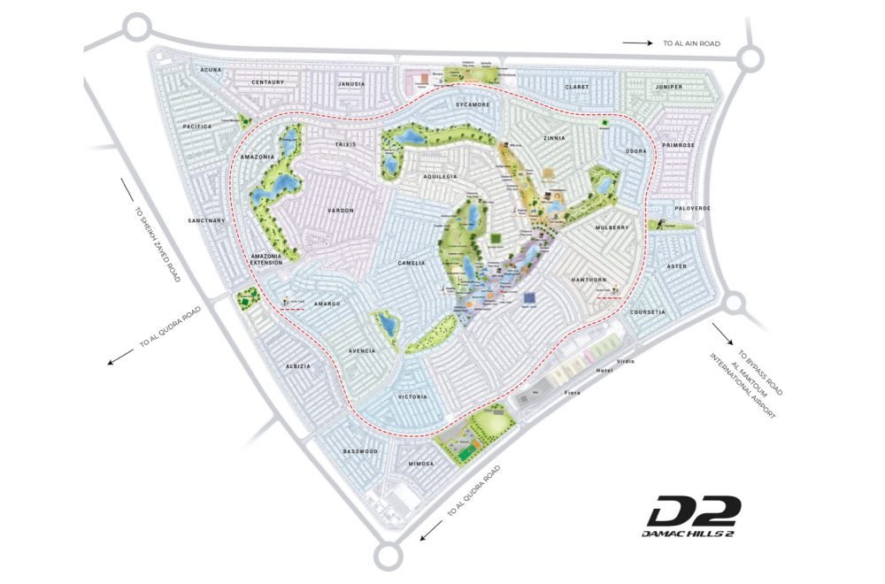
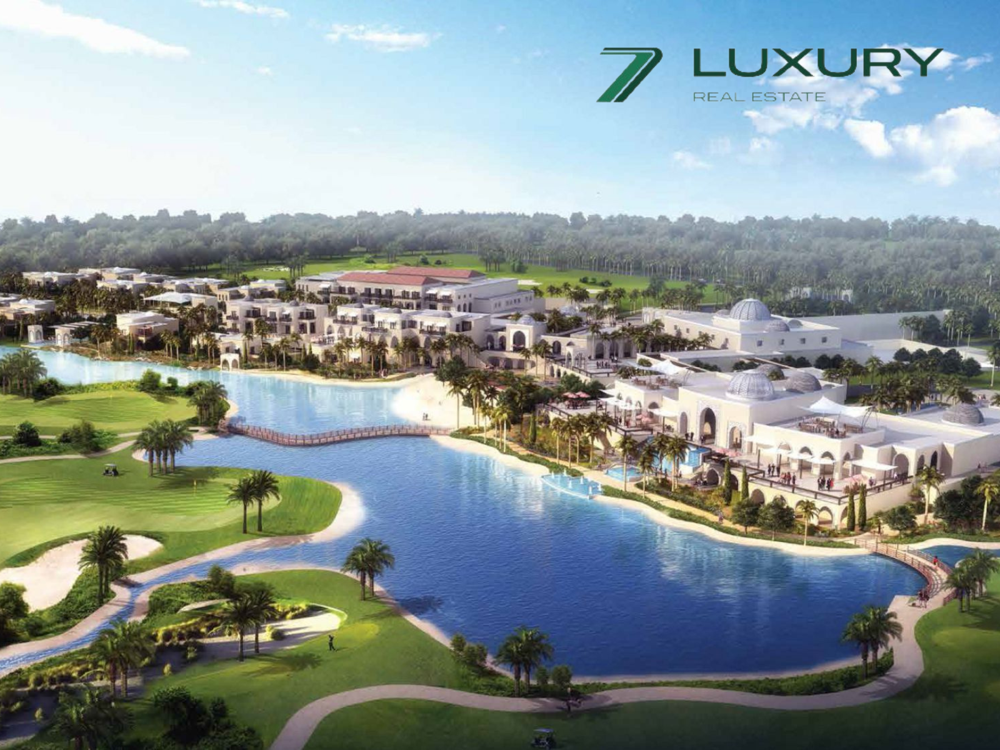

# DAMAC Hills 2

Situated within Dubailand, DAMAC Hills 2 (formerly Akoya Oxygen) is a sprawling master community developed by DAMAC Properties. Encompassing over 42 million square feet, this tranquil enclave offers a distinctive living experience.  
  
Inspired by the success of DAMAC Hills, the group's pioneering residential project, DAMAC Hills 2 presents a curated selection of luxurious villas and townhouses. Lush gardens, parks, fountains, and boulevards create a serene environment, catering to residents seeking a balance between tranquility and upscale living.  
  

## Exclusive Living at DAMAC Hills 2

DAMAC Hills 2 is a master-planned community currently undergoing development. The future vision for the community includes five distinct districts: Water Town, Sports Town, Down Town, Equestrian Town, and Motor Town.  
  
Residents currently enjoy access to a variety of amenities including a hydroponic cafe, community center, retail outlets, and restaurants. The existing offerings are complemented by:

- State-of-the-art gymnasiums
- Temperature-controlled swimming pools
- Dedicated jogging parks and cycling tracks
- Tranquil zen garden
- Tennis, basketball, cricket, and football facilities
- Designated barbecue areas

## Master Plan: A Haven for Diverse Lifestyles

Envisioned as a haven of unparalleled experiences, DAMAC Hills 2 prioritizes resident well-being within a luxurious setting. The meticulously crafted masterplan offers a plethora of leisure amenities, fostering a tranquil and serene environment. 

Unique experiences, some set amidst lush rainforests, are a hallmark of the community. 

Upon completion of Vista Lux, residents will gain access to a sprawling retail haven exceeding 1 million square feet, encompassing luxury hotels, cafes, restaurants, and diverse leisure offerings, all seamlessly interconnected by waterways and scenic walkways.

## Strategic Location:

DAMAC Hills 2 occupies a strategic location within Dubailand, situated between major highways Jebel Ali – Lehbab Road (E77) and Al Ain – Dubai Highway (E66). This proximity positions residents for convenient access to the Expo 2020 site and the heart of Dubai's flourishing residential areas. 

While some areas are under development, a significant portion of DAMAC Hills 2 offers completed residences ready for immediate occupancy.  
  

The community boasts excellent connectivity through Al Qudra Road, ensuring a comfortable commute. Key landmarks are within easy reach, including:

- DAMAC Hills Community: 15 minutes
- Al Maktoum International Airport: 30 minutes
- Dubai International Airport: 35 minutes
- Mall of the Emirates: 35 minutes
- Palm Jumeirah and Burj Al Arab: 40 minutes
- Dubai Mall and Burj Khalifa: 40 minutes
- The Walk JBR: 45 minutes

[For Sale](https://sevenluxuryrealestate.com/status/buy/)

- Start From AED 1,712,000

 [For Sale](https://sevenluxuryrealestate.com/status/buy/)

## [Family Community I Spacious I High-Class Amenities](https://sevenluxuryrealestate.com/dubai-property/family-community-i-spacious-i-high-class-amenities/)

- Start From AED 1,712,000

Damac Hills 2

- 3 Bedrooms
- 3 Bathrooms
- 1208 Sq.Ft

[Load More](#)
