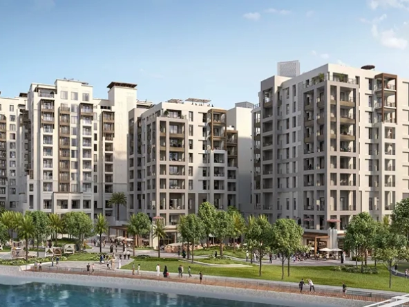
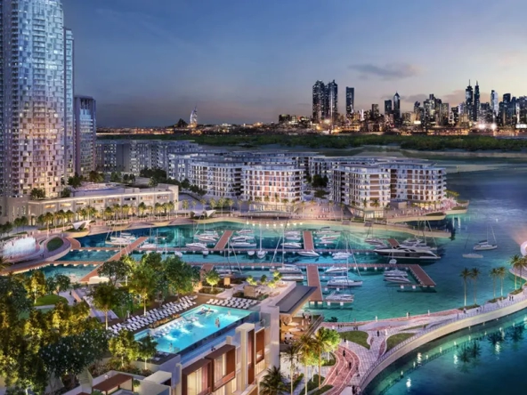
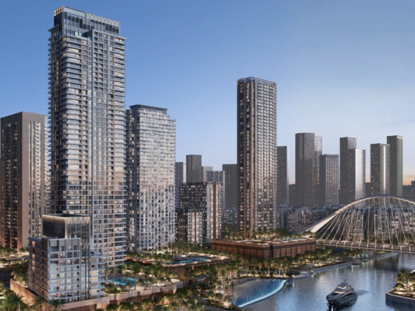

# Dubai Creek Harbour

## Reside In The Heart Of A Bold New Vision For Dubai

Live in Dubai Creek Harbour and experience a community to live, work, play, and more of what really matters. Find yourself in a branded ready to move in & ready-by-year-end waterfront residences in Dubai Creek Harbour by Emaar, and benefit from exclusive limited time offers and an array of world-class amenities where every view is a view to live for.

  
Dubai Creek Harbour is at the heart of Emaar's bold new vision for Dubai. A fusion of creativity and innovation that will define the future of living and further enrich the city and the wider region. 

With spectacular cultural offerings, world-class residences, shopping, amenities, offices and more, Dubai Creek Harbour represents the next frontier in contemporary life, work and play.

Covering a total area of 70 million across the creek and Ras Al Khor wildlife sanctuary, Dubai Creek Harbour promotes a peaceful ambience to all its residents while enabling sustainable as well as breath-taking views all around the vicinity.

Residents of the housing complexes of Emaar Dubai Creek harbour projects will enjoy the luxury of living on an iconic waterfront development in Dubai, set on the banks of the historic Dubai Creek beach apartments. 

The DCH development is set in the centre of dynamic Dubai, 10 minutes from Downtown Dubai and Dubai International Airport on either side of its location. The four metro stations situated around the Dubai Creek Residences community make it easy for its residents to navigate around Dubai and further into the other emirates. 

The DCH development is in the vicinity of the Ras Al Khor Wildlife Sanctuary that is the home of 450 vibrant flamingos. Residents and Visitors of the development can experience a unique blend of contemporary infrastructures and a calming ambience in a prestigious location.

As should be obvious the Dubai Creek Harbor will be a gigantic venture, that includes a blend of private, business, retail, and diversion objections that will change into a unique city of things to come. 

The whole region covers 550 hectares of the Dubai Creek of which 820,000 sq. m. will be for the shopping center and 66,000 sq. m. of social space, and 7.3 million sq. m. of private space. The significant regions in the Dubai Creek Harbor incorporate the Island District, The Sanctuary District, Retail District, and Urban Core District.

## Dubai Creek Harbour Location Features:

- Ras Al Khor Wildlife Sanctuary
- Ready and off plan apartments
- Dubai Creek Harbour Tower
- Plan for 4 Metro links
- Waterfront living
- Luxury amenities
- Stunning views

[Off Plan](https://sevenluxuryrealestate.com/status/off-plan/) [New Launch](https://sevenluxuryrealestate.com/label/new-launch/)

- AED 1,700,000

 [Off Plan](https://sevenluxuryrealestate.com/status/off-plan/) [New Launch](https://sevenluxuryrealestate.com/label/new-launch/)

## [ARLO Dubai Creek Harbour](https://sevenluxuryrealestate.com/dubai-property/arlo-dubai-creek-harbour/)

- AED 1,700,000

Dubai Creek Harbour

- 1-3 Bedrooms
- 705 to 3,276 Sq.Ft

Featured [Off Plan](https://sevenluxuryrealestate.com/status/off-plan/) [New Launch](https://sevenluxuryrealestate.com/label/new-launch/)

- AED 1,480,000

 [Off Plan](https://sevenluxuryrealestate.com/status/off-plan/) [New Launch](https://sevenluxuryrealestate.com/label/new-launch/)

## [Mangrove at Creek Beach by Emaar](https://sevenluxuryrealestate.com/dubai-property/mangrove-at-creek-beach-by-emaar/)

- AED 1,480,000

Dubai Creek Harbour

- 1, 2 & 3 Bedrooms
- 615 to 1,701 Sq.Ft

Featured [Off Plan](https://sevenluxuryrealestate.com/status/off-plan/) [New Launch](https://sevenluxuryrealestate.com/label/new-launch/)

- AED 1,800,000

 [Off Plan](https://sevenluxuryrealestate.com/status/off-plan/) [New Launch](https://sevenluxuryrealestate.com/label/new-launch/)

## [Valo Dubai Creek Harbour EMAAR Properties](https://sevenluxuryrealestate.com/dubai-property/valo-dubai-creek-harbour-emaar-properties/)

- AED 1,800,000

Dubai Creek Harbour

- 1-3 Bedrooms

Featured [Off Plan](https://sevenluxuryrealestate.com/status/off-plan/) [New Launch](https://sevenluxuryrealestate.com/label/new-launch/)

- From AED 1,710,000

 [Off Plan](https://sevenluxuryrealestate.com/status/off-plan/) [New Launch](https://sevenluxuryrealestate.com/label/new-launch/)

## [ORIA Dubai Creek Harbour](https://sevenluxuryrealestate.com/dubai-property/oria-dubai-creek-harbour/)

- From AED 1,710,000

Dubai Creek Harbour

- 1-3 Bedrooms
- 749 to 1,659 Sq.Ft

[Load More](#)
