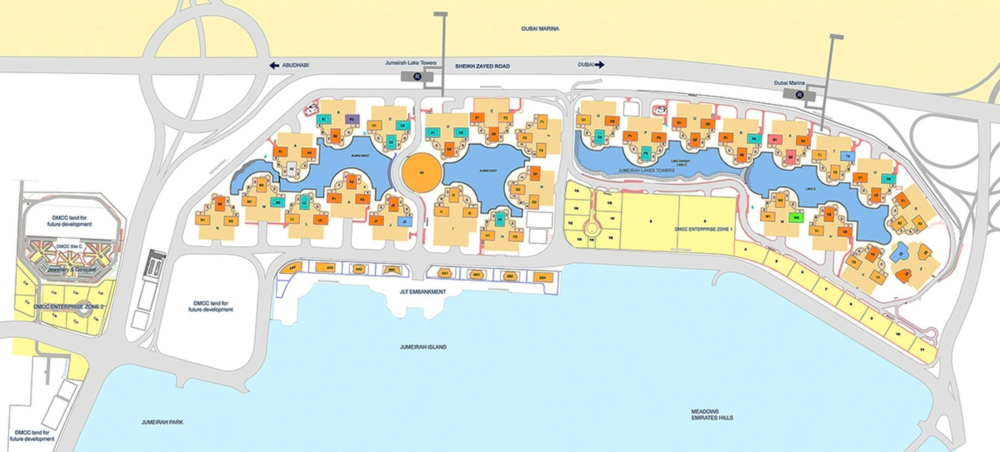
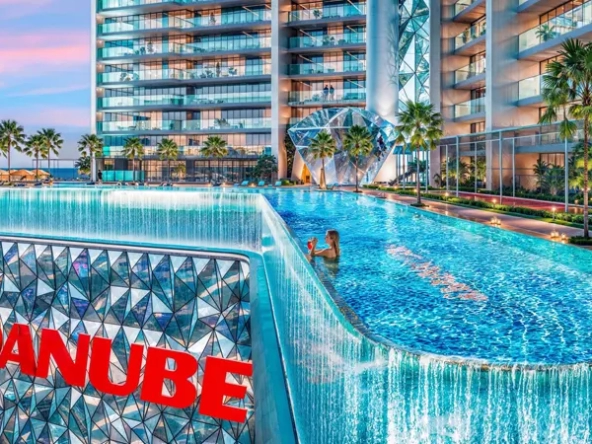
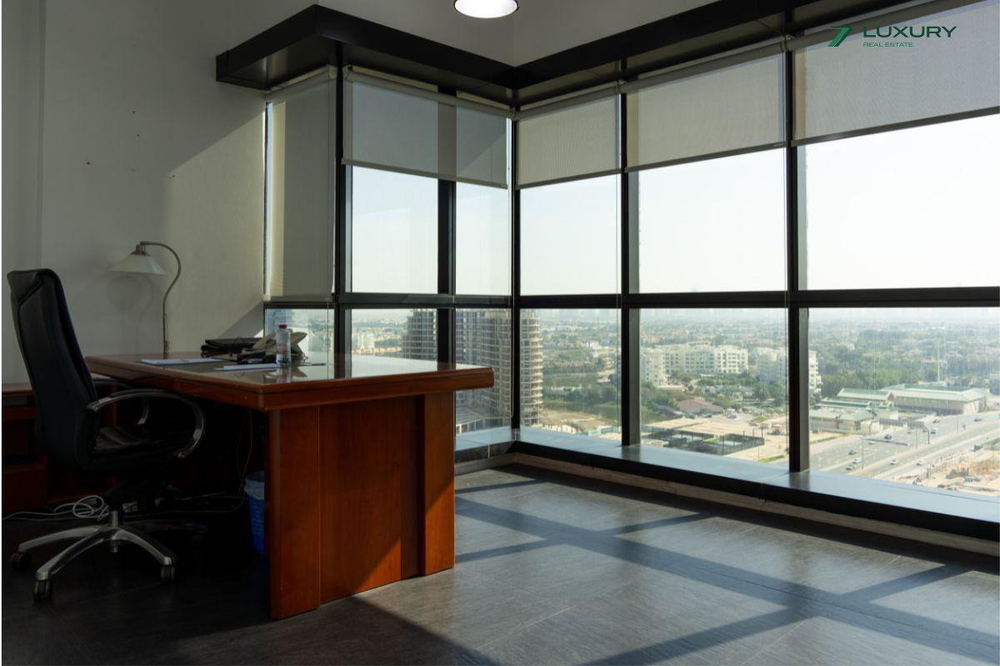

# Jumeirah Lakes Towers (JLT)

## Jumeirah Lake Towers: A Hub for Living, Working, and Playing:

Jumeirah Lake Towers (JLT) is a dynamic waterfront development in Dubai that seamlessly blends residential living, commercial opportunities, and leisure attractions. This thriving district caters to a diverse population, from young professionals to established families, offering a vibrant environment and a convenient lifestyle.

JLT distinguishes itself as a mixed-use development, integrating residential towers, commercial spaces for offices and retail stores, and a range of hotels. This creates a dynamic atmosphere where residents can live, work, and unwind within the same community.  

Imagine stepping out of your apartment for a morning coffee at a local cafe, then heading to your office building within the cluster, all while enjoying scenic lake views.

JLT boasts a unique waterfront setting with three man-made lakes and landscaped promenades. These scenic walkways offer a tranquil escape from the city's buzz, perfect for evening strolls or weekend picnics.  JLT's pedestrian-friendly design further enhances its appeal, allowing residents to navigate the community with ease.
## Jumeirah Lakes Towers (JLT) Location Features:

- Mixed-use development with high-rise towers
- One of Dubai's freehold areas (allowing property ownership)
- 26 clusters, each with three buildings and a waterfront retail area
- Pedestrian-friendly community with easy access to Sheikh Zayed Road
- Diverse offerings including offices, residences, shops, and hotels

## Master Plan: A Haven For Diverse Lifestyles

JLT is meticulously planned and divided into 26 distinct clusters, each featuring three high-rise buildings.  Each cluster offers its own retail space, parking facilities, and a sense of identity. This thoughtful organization ensures a balance between a bustling community and a sense of belonging within smaller neighborhoods.

JLT prioritizes accessibility.  The district provides direct access to Sheikh Zayed Road, Dubai's major artery, ensuring smooth connections to other parts of the city.  Residents also benefit from two conveniently located metro stations, the DMCC Metro Station and the Sobha Realty Metro Station, offering a quick and eco-friendly mode of transportation. 

JLT caters to a variety of lifestyles and budgets with its extensive selection of apartments.  From studios perfect for young professionals to spacious penthouses ideal for families, residents can find their ideal living space. 

Popular clusters like D and Q offer a vibrant selection of apartments for rent, making JLT an attractive option for those seeking a dynamic and social living environment.

Whether you're a business traveler seeking luxurious accommodations or a family on vacation, JLT's diverse range of hotels caters to your needs. The district features renowned luxury establishments like Taj Jumeirah Lakes Towers, known for its impeccable service and stunning views, alongside family-friendly options like Bonnington Hotel JLT, offering comfortable accommodations and convenient amenities.

## Exclusive Living At Jumeirah Lakes Towers (JLT)

JLT is a haven for gourmands.  The district boasts a wide array of restaurants, cafes, and bars, offering a global culinary adventure.  From authentic Vietnamese pho to mouthwatering Greek souvlaki, and everything in between, residents can embark on a flavorful journey around the world without leaving the community. Popular restaurants like Mythos and Wokyo Noodle Bar are just a taste of the diverse culinary scene JLT offers. 

<iframe loading="lazy" src="https://maps.google.com/maps?q=Jumeirah%20Lakes%20Towers%20%28JLT%29&amp;t=m&amp;z=14&amp;output=embed&amp;iwloc=near" title="Jumeirah Lakes Towers (JLT)" aria-label="Jumeirah Lakes Towers (JLT)"></iframe>

JLT caters to families with a variety of nurseries and schools located within the community, ensuring a convenient and safe educational environment for children.  Additionally, JLT Park provides a green sanctuary for families and fitness enthusiasts.  This landscaped park features children's play areas, jogging tracks, and ample space for outdoor activities, making it a popular spot for residents to relax and unwind.

While JLT offers a comprehensive and fulfilling lifestyle within its boundaries, its location unlocks a world of possibilities.  The bustling Dubai Marina is just a short metro ride or taxi trip away, offering a vibrant nightlife scene, world-class shopping malls, and breathtaking views of the Arabian Gulf. JLT's dynamic atmosphere comes with a potential downside.  Traffic congestion, particularly during peak hours, can be a challenge for residents who rely on cars for commutes.  However, the well-developed metro system offers a convenient alternative. Featured [Off Plan](https://sevenluxuryrealestate.com/status/off-plan/)

- AED 1,100,000

 [Off Plan](https://sevenluxuryrealestate.com/status/off-plan/)

## [Diamondz JLT Dubai](https://sevenluxuryrealestate.com/dubai-property/diamondz-jlt-dubai/)

- AED 1,100,000

JLT

- Studio, 1-4 Bedrooms
- 407 to 1,973 Sq.Ft

[For Rent](https://sevenluxuryrealestate.com/status/rent/)

- Start From AED 140,000 Per Annum

 [For Rent](https://sevenluxuryrealestate.com/status/rent/)

## [Ready to move in |Fully fitted & Furnished](https://sevenluxuryrealestate.com/dubai-property/ready-to-move-in-fully-fitted-furnished/)

- Start From AED 140,000 Per Annum

Jumeirah Lake Towers

- 1 Bathroom
- 1095 Sq.Ft

[Load More](#)
