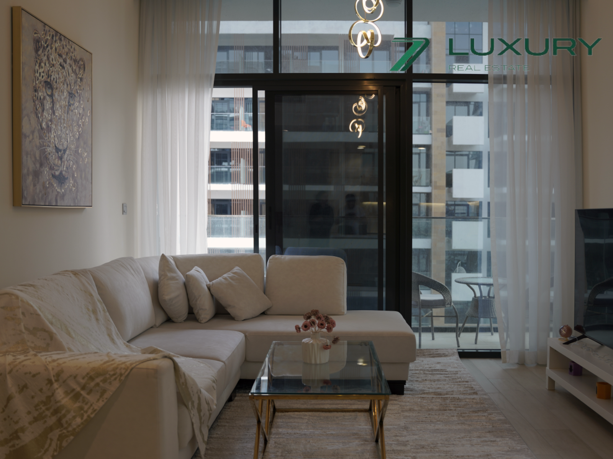
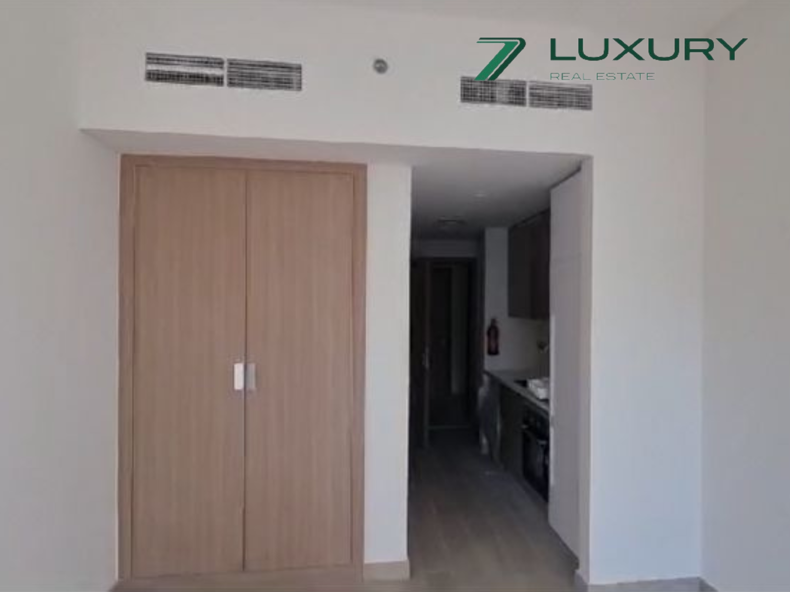
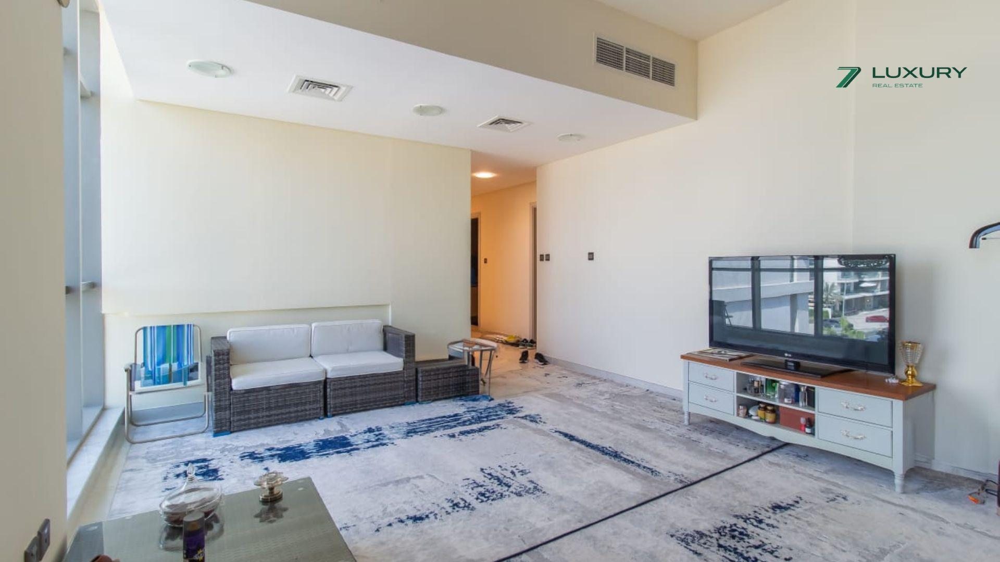

# Meydan City

## MEYDAN City Community & Area Guide

Inspired by the Arabic word for "meeting place," Meydan City is a vibrant Dubai district offering a blend of lifestyles. This mixed-use community features villas, apartments, and offices alongside shops, promenades, and green spaces. Buildings range from low-rise to high-rise, with a nod to oriental design throughout.  
  

Spanning 40 million square feet, Meydan City seamlessly integrates living and working spaces. Imagine strolling from your apartment to a waterfront cafe or stepping out of the office for a lunchtime walk along a scenic canal.  
  

Once a small community, Meydan has blossomed into a major metropolis. It now attracts international attention by hosting prestigious events like the Dubai World Cup. With ongoing development and a mix of completed and upcoming projects, Meydan City is poised to rival Dubai's most sought-after districts.  
  

## Exclusive Living at Meydan City

Imagine a life centered around entertainment, relaxation, and having everything at your fingertips. That's what living in Meydan District offers. Residents are surrounded by world-class venues like the Meydan Racecourse, Meydan Golf Course, and the luxurious Meydan Hotel. Whether you're a horse racing enthusiast, a golfing aficionado, or simply enjoy soaking up the sun at Meydan Beach, there's an activity for everyone.  
  
Foodies rejoice! Meydan District caters to all palates, from upscale restaurants to laid-back cafes. Meydan Avenue is the beating heart of the district, bustling with shops, entertainment options, and frequent events, ensuring a lively atmosphere. Staying active is effortless in Meydan. Numerous parks, jogging tracks, and cycling paths create a haven for fitness enthusiasts. The district's well-designed infrastructure prioritizes convenience, making it easy to commute to other parts of Dubai.  
  

- Horse Racing: Meydan Racecourse - world-class facilities, thrilling events.
- Retail & Entertainment: Meydan One Mall (largest in Dubai!), ski slope, dining & more.
- Luxury Living: Apartments, villas & townhouses - upscale, amenities galore.
- High-End Hotels: Meydan Hotel & Bab Al Shams Resort - luxury stays, fine dining, top spas.
- Prime Location: Close to Downtown Dubai, Dubai Mall & Burj Khalifa - easy access to city gems.

<iframe loading="lazy" src="https://maps.google.com/maps?q=Nad%20Al%20Sheba%201&amp;t=m&amp;z=12&amp;output=embed&amp;iwloc=near" title="Nad Al Sheba 1" aria-label="Nad Al Sheba 1"></iframe>

## Master Plan: A Haven for Diverse Lifestyles

Meydan City is a vibrant hub buzzing with activities. The iconic Meydan Racecourse, host to prestigious horse racing events, takes center stage. But that's just the beginning! Here, you can tee off at the 9-hole golf course, explore the Meydan Marina, or delve into equestrian history at the racing gallery and museum.  
  

Thinking of introducing your kids to golf? The Track Meydan Golf offers excellent lessons. And for those seeking sky-high luxury, the record-breaking Dubai One Tower in Meydan One offers everything you need: a five-star hotel, conference facilities, stunning residential suites, and easy access to the Meydan One Marina Yacht Club. For family fun, Al Quoz Pond Park, just a short distance away, is a perfect choice.

Meydan City caters to all interests. Its grand entrance, towering skyscrapers, shopping malls, scenic canals, parks, and residential areas with jogging tracks, cycling paths, and playgrounds ensure there's never a dull moment.

For the ultimate entertainment experience, there are IMAX theaters, a bustling concourse plaza, a unique sky bubble restaurant, exciting clubs, and a charming boat house. Living here is pure luxury. The villas and apartments boast world-class amenities, and spas, salons, and swimming pools are conveniently located nearby, offering the perfect escape after a busy day.

## Strategic Location:

Meydan City is easy to get to from many parts of Dubai thanks to its great transportation options. It sits right next to two important roads, Ras Al Khor Road and Dubai-Al Ain Road, which make it a breeze to travel to other parts of the city. To make getting around even easier, there are plans for a new tram line that will connect Meydan City to the Meydan Racecourse and can carry up to 10,000 people.  
  
Right now, public buses connect to several metro stations in the city, so you can easily get around the area and beyond. The closest metro station is a 15-minute drive from Meydan City in Business Bay. Taxis are the most popular way to get around for most people in Meydan City because they're a convenient and fast option. You can easily hail a taxi with the RTA app or book a ride with Uber or Careem. [For Rent](https://sevenluxuryrealestate.com/status/rent/)

- Start From AED 100,000 Per Annum

 [For Rent](https://sevenluxuryrealestate.com/status/rent/)

## [Prime Location | Spacious | Brand New](https://sevenluxuryrealestate.com/dubai-property/prime-location-spacious-brand-new-2/)

- Start From AED 100,000 Per Annum

Meydan

- 1 Bedroom
- 1 Bathroom
- 687 Sq.Ft

[For Sale](https://sevenluxuryrealestate.com/status/buy/)

- Start From AED 1,400,000

 [For Sale](https://sevenluxuryrealestate.com/status/buy/)

## [Prime Location | Spacious | Brand New](https://sevenluxuryrealestate.com/dubai-property/prime-location-spacious-brand-new/)

- Start From AED 1,400,000

Meydan

- 1 Bedroom
- 1 Bathroom
- 687 Sq.Ft

[For Rent](https://sevenluxuryrealestate.com/status/rent/)

- Start From AED 50,000 Per Annum

 [For Rent](https://sevenluxuryrealestate.com/status/rent/)

## [Brand New Studio | Ready to move in | Community View](https://sevenluxuryrealestate.com/dubai-property/brand-new-studio-ready-to-move-in-community-view/)

- Start From AED 50,000 Per Annum

Meydan

- 1 Bathroom
- 352 Sq.Ft

[For Sale](https://sevenluxuryrealestate.com/status/buy/)

- Start From AED 1,200,000

 [For Sale](https://sevenluxuryrealestate.com/status/buy/)

## [luxury apartment | High Floor | Garden View](https://sevenluxuryrealestate.com/dubai-property/luxury-apartment-high-floor-garden-view/)

- Start From AED 1,200,000

Meydan

- 1 Bedroom
- 1 Bathroom
- 851 Sq.Ft

[Load More](#)
