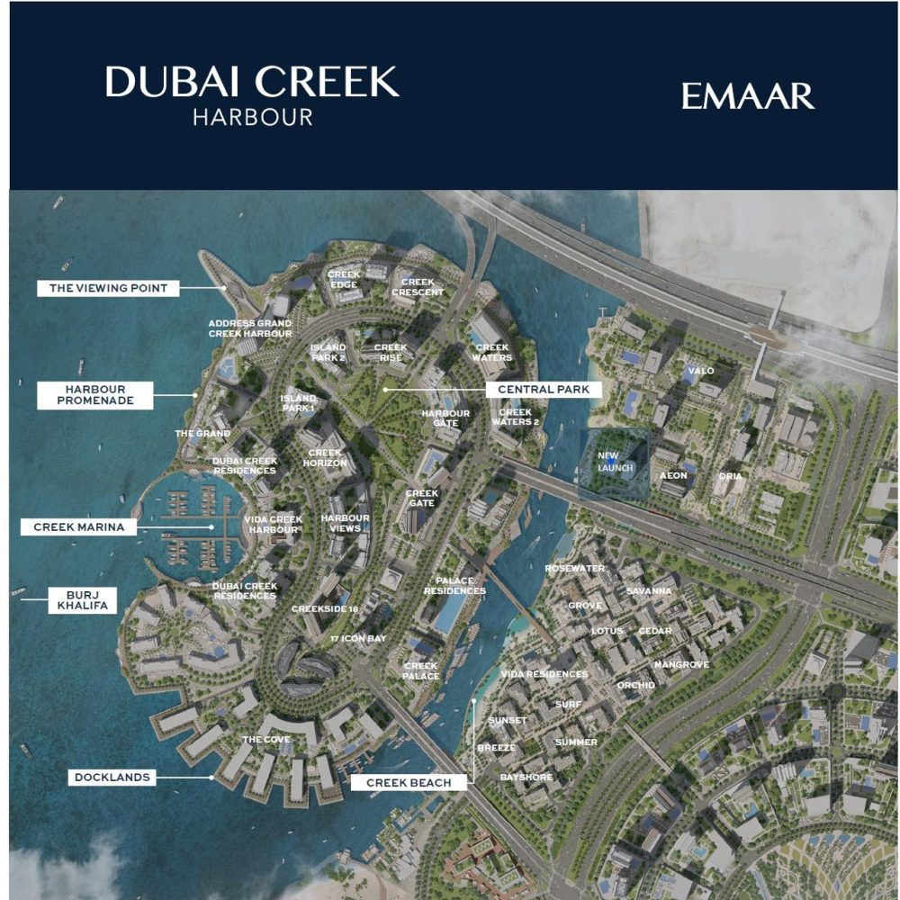

****Modern Luxury Awaits**** **at ARLO Dubai Creek Harbour**

ARLO, the newest residential tower by EMAAR in Dubai Creek Harbour, presents a unique opportunity to embrace modern luxury living. These 1,2, and 3-BR apartments and 3-BR Townhouses seamlessly blend contemporary design with the timeless charm of Dubai Creek.

The vibrant community boasts breathtaking open skies, picturesque water views, and a dynamic mix of residential, commercial, and recreational spaces, fostering a perfect environment to create lasting memories.

**Unparalleled Connectivity and Convenience**

Dubai Creek Harbour offers exceptional connectivity with a robust transportation network including well-maintained roads, buses, four metro stations, water taxis to Downtown Dubai, and pedestrian-friendly walkways. The area is further enriched by a diverse range of retail, business, recreational, and community facilities, ensuring a well-rounded lifestyle.

**Immerse Yourself in Nature's Embrace**

Situated along the historic Dubai Creek, ARLO residents will find themselves surrounded by a haven of biodiversity. The neighboring Ras Al Khor Wildlife Sanctuary provides a sanctuary for tens of thousands of birds, offering a unique opportunity to connect with nature.  

**A Vibrant Waterfront Experience**

Explore Creek Marina, a bustling hub brimming with retail, dining, and recreational options. Harbour Promenade invites residents to experience a vibrant waterfront lifestyle with breathtaking views of Downtown Dubai and world-class art installations. This unique perspective offers an unforgettable way to admire the glistening waters of Dubai Creek.

