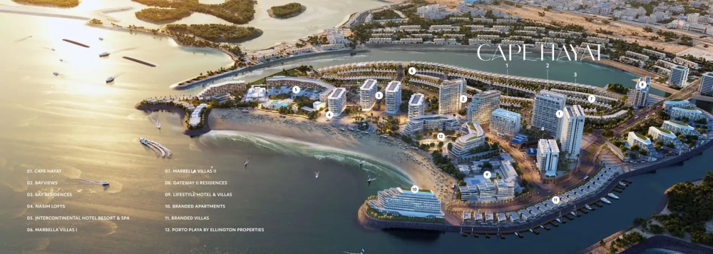

Located at the heart of Hayat Island in Mina Al Arab, Cape Hayat is a symbol of luxury and elegance, seamlessly combining modern architecture with the surrounding natural beauty. This residential development features a thoughtfully curated collection of apartments, including sleek studios, one and two-bedroom units, as well as opulent four-bedroom penthouses.

## **Breathtaking Views and Functional Elegance**

Each residence at Cape Hayat offers captivating views, whether it’s the serene mangroves, the vast ocean, the peaceful canal, or the towering mountains. Designed with a focus on both aesthetics and functionality, the development boasts state-of-the-art amenities alongside a selection of retail options, catering to those who seek a refined lifestyle that merges everyday living with the ambiance of a permanent holiday retreat.

## **A Luxurious Living Experience**

Developed by RAK Properties, Cape Hayat presents an opportunity to indulge in luxury living, offering a range of sophisticated apartments and penthouses. With a prime location, top-tier amenities, and an unparalleled lifestyle, this development invites residents to experience both comfort and convenience in a setting that is nothing short of extraordinary.

## **A Tranquil Oasis in a Prime Location**

Positioned within the lush, green landscape of Hayat Island, this residential community offers an exceptional living environment in the vibrant city of Ras Al Khaimah. The natural surroundings and pleasant climate create a serene atmosphere, promising an unparalleled lifestyle in a peaceful oasis.

## **A Lifestyle Beyond Luxury Residences**

Cape Hayat goes beyond offering luxurious homes; it presents a lifestyle enriched by an array of amenities and services that cater to every aspect of life. Whether you're passionate about outdoor activities, fitness, or simply relaxation, the development provides something for everyone. The connection with nature further enhances the experience, giving residents the opportunity to fully immerse themselves in the unique island life.

Immerse yourself in the island lifestyle, where every day feels like a holiday. Enjoy the gentle sea breeze from your window and bask in the sophisticated, serene environment that Cape Hayat offers. The development is located near world-class hotels such as the InterContinental and Anantara, as well as a variety of dining and retail options, making it the ideal place to experience an elevated lifestyle.

## **A Wealth of Amenities**

The development offers an extensive range of amenities aimed at enhancing the lifestyle of its residents. Outdoor enthusiasts can take advantage of dedicated cycling and running tracks, ideal for both leisurely activities and more intense workouts. Residents can also enjoy the exclusivity of a private club, unwind at stylish BBQ areas, or achieve their wellness goals at the modern fitness center. Whether it’s socializing or relaxation, Cape Hayat has something for everyone.

## **Key Highlights**:

- A selection of luxury studios, one to two-bedroom apartments, and spacious four-bedroom penthouses

- Centrally located on Hayat Island, Mina Al Arab, Ras Al Khaimah

- Surrounded by lush greenery and a temperate, natural climate

- Offers a premium lifestyle with a wide range of amenities

- Proximity to the InterContinental Hotel and other luxury resorts

- Dedicated cycling and running tracks for fitness enthusiasts

- Exclusive private club for residents to relax and socialize

- BBQ areas for outdoor gatherings in a scenic setting

- On-site shopping mall providing convenience for daily needs

- Multiple luxury hotels and resorts nearby for an exquisite living experience
