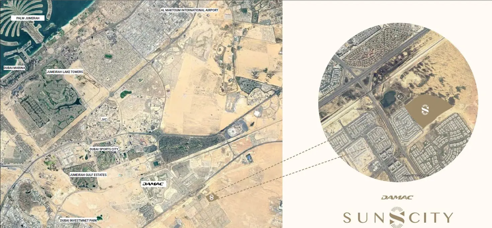

Welcome to a realm where each day is illuminated by the gentle embrace of sunlight. DAMAC Sun City harmoniously combines luxury with wellness, presenting residences that deepen your bond with nature. Thoughtfully designed with expansive balconies and terraces, each home is intended to elevate comfort and foster outdoor living, transforming your space into a haven that nurtures health and happiness.

## **A Commitment to Wellness**

DAMAC Sun City transcends the concept of mere housing; it represents a dedication to enriching your body, mind, and spirit. Every facet of this community, from productive workspaces to tranquil relaxation areas, is meticulously crafted with your holistic well-being in focus. Inspired by the natural beauty surrounding it and the invigorating power of the sun, this environment encourages a balanced lifestyle.

## **A Tranquil Community**

Nestled in the heart of Dubailand, DAMAC Sun City serves as a serene escape from the frenetic pace of urban life while still providing easy access to major thoroughfares. Benefit from close proximity to Al Maktoum International Airport and a variety of local amenities that cater to your daily needs.

## **Exceptional Amenities:**

- Outdoor Sauna Cabins

- Fully Equipped Gym & Yoga Studio

- Wild Garden Amphitheatre

- Scenic Forest Hiking Trail

- Tennis Court

- Multi-Sport Court

- Children’s Outdoor Play Area

- Outdoor Camping Facilities

## **An Ideal Location**

- 10 minutes to The Village Community Mall

- 18 minutes to South View School Dubai

- 23 minutes to Health Connect Clinic

- 23 minutes to Al Maktoum International Airport

- 24 minutes to GEMS Winchester School Dubai

- 28 minutes to Dubai International Airport

## **Key Features**

Discover a new master community development featuring a premium collection of 4 and 5-bedroom townhouses, where every moment is filled with adventure. Located at a prime hotspot in Dubailand, these homes offer seamless access to renowned landmarks and exquisite leisure venues.

The townhouses embody a modern aesthetic complemented by natural materials, featuring expansive glass facades that merge indoor and outdoor environments harmoniously.

## **Nature-Inspired Wellness**

This tranquil community is designed to enhance well-being by blending nature-inspired spaces with state-of-the-art amenities. Outdoor yoga areas, forest hiking trails, and a wild garden amphitheatre create an integrated experience of nature and luxury living.

## **Unique Amenities for Holistic Health**

Enjoy exclusive features such as an ice bath station and outdoor sauna cabins, along with a gym that aligns with natural rhythms. Engage in dynamic workouts at the monkey bar area, an outdoor fitness space that promotes movement, agility, and comprehensive wellness.
