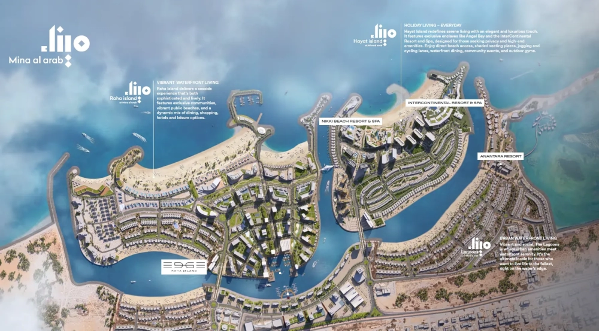

EDGE at Raha Island is an innovative residential community that seamlessly combines modern urban living with the peaceful ambiance of coastal life. It stands as a unique retreat, offering the best of both worlds for those seeking a refined yet tranquil lifestyle by the sea.

## **Diverse Living Options in Mina Al Arab**

This exclusive development, located at Mina Al Arab in Ras Al Khaimah, offers a variety of high-end living spaces, ranging from elegantly crafted studios to expansive two-bedroom apartments and opulent penthouses. Each unit is thoughtfully designed to reflect luxury and sophistication, providing residents with an unparalleled living experience.

## **Elegance Meets Coastal Tranquility**

With yacht-inspired balconies, premium finishes, and breathtaking lagoon views, EDGE on Raha Island is the epitome of urban island elegance. The development, a new venture by RAK Properties, features studio, one, and two-bedroom apartments as well as penthouses, all offering stunning waterfront views. The building’s design flawlessly merges sophisticated interiors with the calming beauty of island life, providing residents with a serene and picturesque environment.

## **An Idyllic Waterfront Community**

Situated in Mina Al Arab, a renowned waterfront community in Ras Al Khaimah, Raha Island offers residents a peaceful escape from city life. This protected coastal wetland boasts pristine beaches, lush greenery, and a rich ecosystem, including the famous flamingo reserves. Residents here can enjoy a resort-like lifestyle with access to world-class amenities such as water sports, nature trails, and luxurious resorts, all within a vibrant and serene setting.

## **Exclusive Living Spaces**

The development features two podium levels, each with ten chalets overlooking the lagoon, offering residents a direct connection to the tranquil waters. Above these chalets, ten floors of premium apartments cater to a range of living preferences, while the 11th floor houses two exclusive penthouses. These penthouses provide an elevated living experience, offering unparalleled luxury and sophistication. The building’s architecture, enhanced by lush greenery and elegant lighting, creates a welcoming atmosphere that radiates serenity, particularly at night.

- Offers a selection of studios, one-and-two-bedroom apartments, and luxurious penthouses, all designed with comfort and elegance in mind.

- Located on Raha Island in Mina Al Arab, combining modern living with the tranquil charm of coastal life, with easy access to key destinations.

- Striking architectural design with angular, yacht-inspired balconies and bold façades, blending modern aesthetics with waterfront beauty.

- Two podium levels featuring chalets with lagoon-facing façades, providing a distinctive living experience with stunning waterfront views.

- The community offers a dynamic seaside lifestyle with public beaches, fine dining, shopping, hotels, and leisure facilities, perfect for those seeking a sophisticated waterfront lifestyle.

- Amenities include a lounge and clubhouse, skating area, children's outdoor play zone, an expansive swimming pool, and more, catering to a variety of recreational needs.
