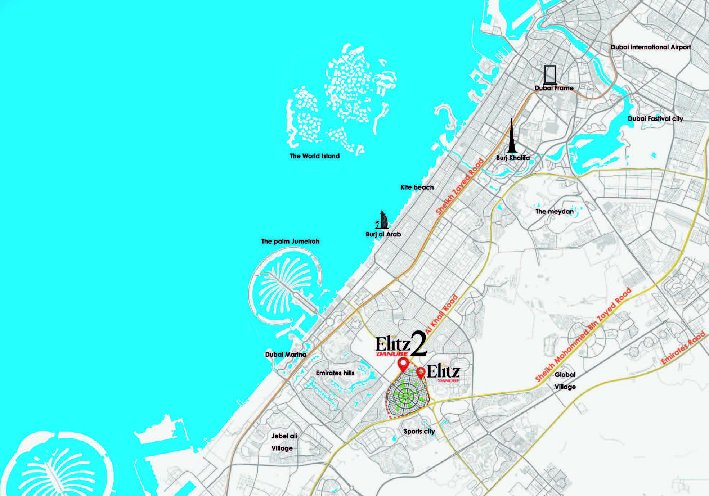

**Elitz 2** by Danube is a contemporary architectural masterpiece nestled within the vibrant Jumeirah Village Circle (JVC). This iconic twin-tower development offers a diverse range of studios, 1, 2, and 3 Bedroom apartments, complemented by retail and commercial spaces.

- **Prime Location:** Strategically positioned with easy access to major thoroughfares such as Al Khail Road, Sheikh Mohammed Bin Zayed Road, and Sheikh Zayed Road.

- **Unparalleled Amenities:** Indulge in a luxurious lifestyle with over 40 amenities catering to fitness, wellness, recreation, and community engagement.

- **Flexible Payment Plan:** Own your dream home with a convenient 1% monthly payment plan.

**Anticipated Completion:** October 2026

### **Lifestyle and Amenities**

Elitz 2 redefines contemporary living with its exquisite design, lavish interiors, and unparalleled amenities. Residents can enjoy a plethora of facilities including:

- **Fitness and Wellness:** State-of-the-art gyms, swimming pools, spa, yoga areas, and health club.

- **Recreation:** Tennis courts, cricket pitch, mini-golf, and various indoor and outdoor games.

- **Community:** Children's play areas, daycare, business center, and social spaces.

### **JVC: A Thriving Community**

Jumeirah Village Circle is a sought-after residential area offering a balanced lifestyle. Its strategic location, diverse community, and modern amenities make it an ideal place to call home.

**Key Benefits of JVC:**

- Excellent connectivity to major roads

- Vibrant and family-friendly environment

- Proximity to essential amenities

**Location Highlights:**

- 20 minutes from Dubai International Airport

- 19 minutes from Palm Jumeirah

- 15 minutes from Burj Al Arab

- 19 minutes from Jumeirah Beach

Elitz 2 offers an exceptional opportunity to experience refined living in the heart of JVC.

