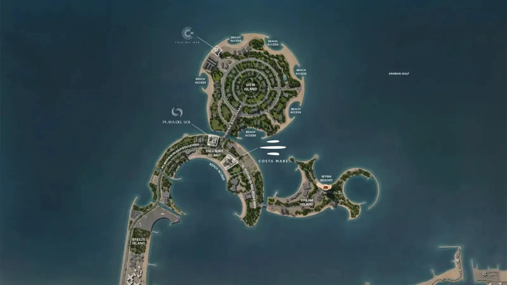

Ellington Costa Mare presents a modern take on coastal living, seamlessly blending nature-inspired architecture with intelligent AI-driven home solutions. Nestled in the breathtaking landscape of Ras Al Khaimah, this exceptional waterfront development offers panoramic sea views, serene outdoor spaces, and direct beach access. Strategically located near the Wynn Resort, Costa Mare creates a harmonious balance between contemporary elegance and the emirate’s untouched natural beauty.

More than just a residence, Costa Mare embodies a refined lifestyle centered on relaxation, social engagement, and personal well-being. Designed with meticulous attention to detail, every space fosters an atmosphere of comfort and sophistication, integrating leisure, fitness, and entertainment effortlessly. Enveloped by majestic mountains, flourishing mangroves, and pristine golden shores, this island retreat offers an unparalleled living experience where nature and modernity coexist in perfect balance.

## **Prime Location: Al Marjan Island, Ras Al Khaimah**

Situated on the prestigious Al Marjan Island, Costa Mare enjoys a coveted position in one of Ras Al Khaimah’s most sought-after destinations. This vibrant location is renowned for its tranquil surroundings, stunning beachfronts, and seamless connectivity. Offering a unique fusion of natural splendor and urban convenience, the community is ideal for those seeking an elevated coastal lifestyle.

**Unmatched Accessibility to Key Attractions**

Residents of Costa Mare benefit from effortless connectivity to prominent destinations across Ras Al Khaimah and beyond:

- 2 MINUTES – Wynn Resort

- 12 MINUTES – Al Hamra Mall

- 13 MINUTES – RAK Central

- 14 MINUTES – Al Hamra Golf Club

- 16 MINUTES – RAK Track

- 20 MINUTES – Royal Yacht Club of Ras Al Khaimah

- 30 MINUTES – RAK Mall

- 30 MINUTES – Al Qawasim Corniche & RAK Eye

- 35 MINUTES – Ras Al Khaimah International Airport

- 46 MINUTES – Jebel Jais Entrance

- 50 MINUTES – Sharjah International Airport

- 60 MINUTES – Dubai International Airport

Costa Mare is more than a residence—it’s a sanctuary where luxury meets serenity, offering an unparalleled lifestyle in one of the UAE’s most captivating coastal destinations.
