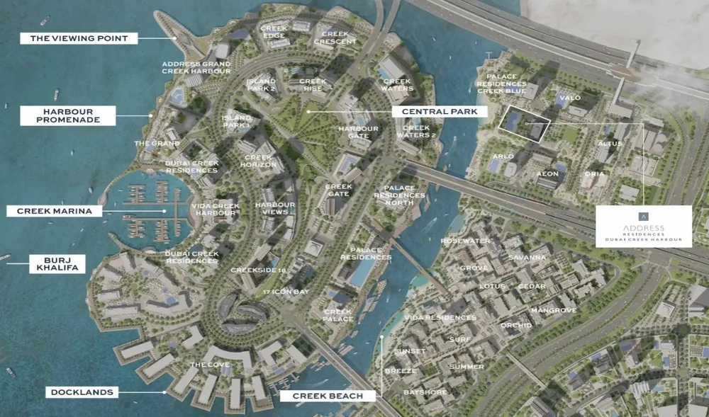

Experience the pinnacle of luxury at EMAAR Address Residences, a newly launched 5-star branded residence located in Dubai Creek Harbour. Set against the backdrop of Dubai’s stunning skyline and the tranquil waters of Dubai Creek, this development presents a unique lifestyle opportunity for those seeking exceptional living.

EMAAR Address Residences seamlessly blend elegant design with top-tier amenities, making it an ideal choice for those in pursuit of a sophisticated, high-end lifestyle. The residences feature contemporary layouts, expansive interiors, and floor-to-ceiling windows that offer breathtaking views. Every aspect has been thoughtfully curated, from the premium finishes to the integration of smart home technology, ensuring a perfect balance of comfort and style.

## **Unmatched Amenities and Prime Location**

Residents will have access to a range of exclusive amenities, including infinity pools, modern fitness centers, and gourmet dining options. The development also offers direct access to various retail and leisure outlets, creating a vibrant and upscale living environment that is both peaceful and lively. Its proximity to major landmarks, such as Downtown Dubai and Dubai International Airport, adds to the convenience of this prime location.

Investing in EMAAR Address Residences at Dubai Creek Harbour offers an opportunity to be part of a community that redefines urban living in Dubai. Whether you are looking for a luxurious residence or a high-return investment, this new launch by EMAAR guarantees an unparalleled lifestyle and exceptional financial returns.

## **Key Features of EMAAR Address Residences**

- Balcony or Terrace

- Beachfront Access

- Community Centre

- Cycling Path

- Dining Outlets

- Golden Beach

- Gymnasium

- Health Care Centre

- Kids Play Area

- Restaurants

- Swimming Pool

## **Dubai Creek Harbour: A Visionary Community**

Dubai Creek Harbour exemplifies Dubai’s ambition to harmonize modern urban living with natural beauty. Situated along the historic Dubai Creek, this dynamic community offers a variety of residential options, from sleek apartments to luxurious waterfront villas. Developed by Emaar Properties, Dubai Creek Harbour is more than just a residential area—it is a city within a city, featuring landmarks such as the Dubai Creek Tower. Residents enjoy a unique lifestyle that effortlessly combines urban convenience with the serenity of nature, enhanced by scenic parks, promenades, and breathtaking views of the Dubai skyline.

## **EMAAR Properties: A Global Leader in Real Estate**

EMAAR Properties is a global leader in the development of iconic real estate projects in Dubai. Known for their visionary developments, EMAAR continually sets new standards for luxury, innovation, and sustainability within the real estate industry.
