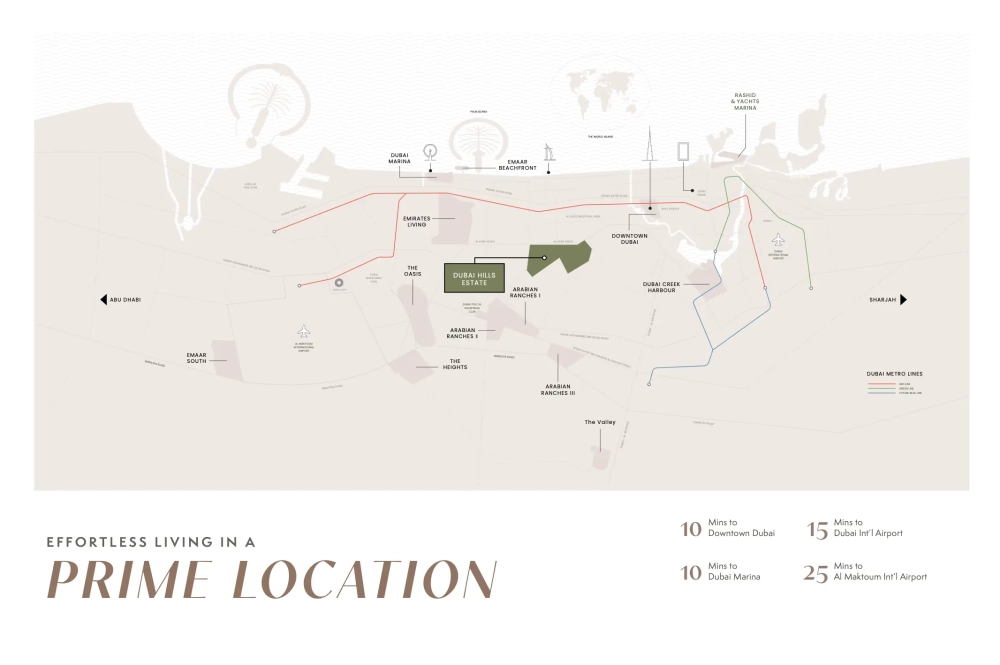

With an uninterrupted view of a verdant golf course stretching far into the horizon. At Golf Hillside, offering 1, 2, and 3-bedroom apartments, you're not just living—you’re thriving. Nestled in the peaceful surroundings of Dubai Hills Estate, you'll experience a blend of tranquility and the vibrant energy of a modern, well-connected community, all while enjoying unobstructed views of lush golf greens and elegant villa neighborhoods.

## **Proximity to Key Amenities**

Living at Golf Hillside places you close to all the essentials that matter most. Whether you're searching for renowned schools, top-tier healthcare, or a convenient shopping experience, everything is within easy reach. And when it's time to relax, the peaceful Dubai Hills Golf Club is just a short walk away, offering a serene escape into nature.

## **Central and Luxurious Location**

Experience a refined lifestyle in a location that offers both convenience and peace. Golf Hillside’s strategic position ensures you're close to the action without being overwhelmed by it. With easy access via Al Khail Road, Downtown Dubai and other major destinations are only minutes away. Future connections through Etihad Rail and Dubai Metro will further enhance your access to airports and other emirates.

Golf Hillside at Dubai Hills Estate provides a peaceful retreat within a dynamic city. Surrounded by lush green landscapes and vast open spaces, you’ll return home to breathtaking views of the Dubai Hills Golf Course. The low-rise neighborhoods, combined with modern urban luxury, create a unique balance of city living with a touch of suburban charm.

## **Tailored for Your Lifestyle**

At Golf Hillside, a range of luxurious one- to three-bedroom apartments await you, each designed with precision and care to meet diverse lifestyle needs. These thoughtfully crafted spaces are designed to offer comfort and tranquility, providing an ideal environment for relaxation and personal rejuvenation.

## **Premium Amenities for Elevated Living**

Golf Hillside offers an unmatched living experience with an array of world-class amenities. The elevated podium features a sophisticated pool area, while residents also have access to facilities such as a multipurpose room, a children’s play area, and a fully equipped fitness center, all designed to enhance your day-to-day life.

## **Key Amenities Include:**

- Pool & Pool Deck

- Children's Play Area

- MUGA Court & Fitness Facilities

- Indoor Multipurpose Room

- Landscaped Podium Deck

- 24-hour Security

- Covered Car Park

## **The Prestige of Dubai Hills Estate**

Dubai Hills Estate, developed by EMAAR, is an elite community that symbolizes sophisticated urban living. With a variety of luxurious properties, including stunning villas and high-end apartments, this community offers a remarkable opportunity for property investment in Dubai. Known for its commitment to excellence, Dubai Hills Estate merges modern living with the beauty of nature. It is also a key destination for off-plan projects, providing investors with an opportunity to participate in the development of Dubai’s dynamic skyline. With stunning views of iconic landmarks like the Burj Khalifa, this community stands as a testament to Dubai's commitment to offering premium real estate options.

## **Key Highlights of Dubai Hills Estate:**

- 2,700-acre multi-purpose development

- 18-hole championship golf course

- 1,450,000 sqm of parks and open spaces

- 180,000 sqm Dubai Hills Park

- 282,000 sqm Dubai Hills Mall

- 3 prestigious schools

- 54 km of bicycle routes
