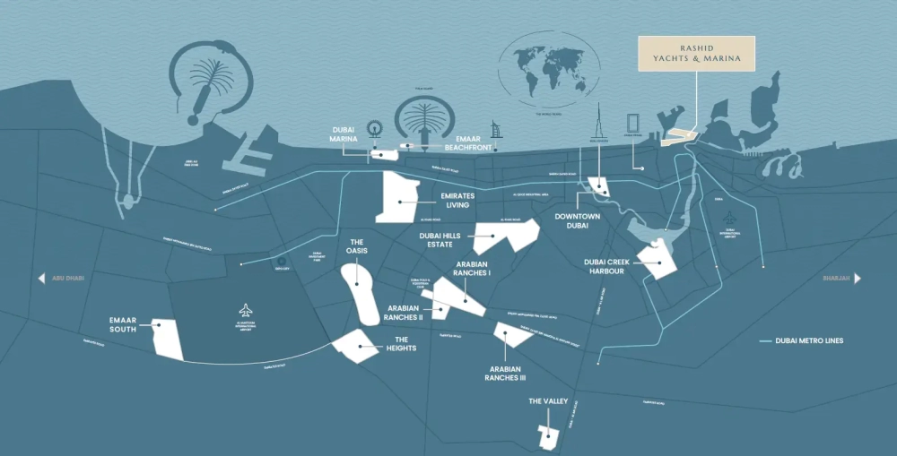

Marina Place stands as a beacon of modern waterfront living, featuring two sophisticated towers gracefully connected by a verdant landscaped podium. This lush green space is more than a visual connection—it is a serene haven with peaceful gardens, yoga platforms, and cozy BBQ areas. Nestled within the prestigious Rashid Yachts & Marina, Marina Place perfectly blends the timeless maritime spirit with the modern rhythm of Dubai.

## **Experience a Coastal Lifestyle Like No Other**

Located at the heart of Rashid Yachts & Marina, Marina Place bridges two worlds—just moments from the historic allure of old Dubai and the vibrant energy of Downtown. The thoughtfully designed podium and communal areas foster a deep sense of belonging and community. Whether drawn to the city's dynamic lifestyle or the tranquil allure of the marina, Marina Place provides effortless access to the best of both.

At Marina Place, every window becomes a frame for captivating scenery. Enjoy the calming marina waters, the lush landscaped podium below, or the iconic Dubai skyline. Whether you begin your day with a sunrise or unwind with the glittering cityscape at night, these breathtaking views redefine home as a sanctuary of inspiration.

## **Redefining Waterfront Luxury**

Rashid Yachts & Marina is Dubai’s newest global hotspot for yachting enthusiasts and connoisseurs of fine living. Combining modern waterfront architecture with a luxurious marina, this destination seamlessly blends high-end residences, fine dining, and boutique retail into a lifestyle that embodies "living at sea."

## **Thoughtful Design for Elevated Living**

Two elegant residential towers, connected by a landscaped podium, showcase a seamless transition between indoor and outdoor living. Each residence is meticulously crafted to maximize natural light and create spacious, open layouts that offer unparalleled comfort and style.

## **Residences Tailored to Your Lifestyle**

Marina Place caters to a variety of preferences, offering chic one-bedroom apartments and expansive three-bedroom homes. With high ceilings, spacious interiors, and floor-to-ceiling windows, every residence is designed to complement its stunning surroundings.

## **Amenities That Enhance Every Moment**

Marina Place redefines luxury living with an array of world-class amenities:

- An exclusive infinity pool overlooking the marina.

- A state-of-the-art gym for fitness enthusiasts.

- Dedicated children’s play areas and multipurpose rooms.

- A landscaped podium featuring tranquil gardens, yoga platforms, and recreational spaces for all ages.

Rashid Yachts & Marina is more than a residential development; it is a masterpiece on Dubai’s Arabian Gulf coastline. As a premier yachting destination, this visionary project sets new benchmarks in coastal elegance. It blends Emaar's signature luxury with meticulous attention to detail, creating an architectural marvel that reimagines waterfront living.  

## **Key Highlights:**

- Choose from carefully designed 1 to 3-bedroom apartments and exclusive 3-bedroom townhouses with spacious layouts and breathtaking views.

- Prime location in Rashid Yachts & Marina, offering seamless access to Dubai’s historic and modern attractions.

- Residences feature floor-to-ceiling windows framing serene marina waters, lush gardens, and the dynamic skyline.

- Landscaped podium includes tranquil gardens, yoga decks, and outdoor community spaces for enhanced living.

- Interiors exude sophistication, crafted with high ceilings, premium materials, and an inviting color palette.

- Indulge in retail and dining excellence, with upscale outlets and gourmet experiences at your doorstep.

Marina Place at Rashid Yachts & Marina invites you to immerse yourself in a lifestyle that celebrates luxury, comfort, and the essence of Dubai’s vibrant waterfront charm.
