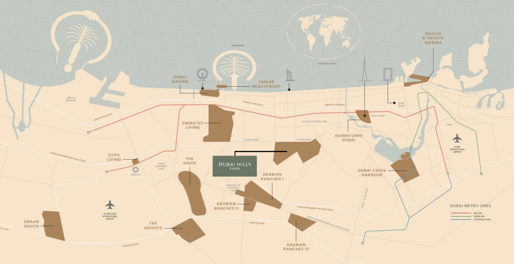

Emaar Parkwood is a prestigious residential project currently under development within Dubai Hills Estate. This new offering by Emaar Properties presents an array of modern living spaces, including 1, 2, and 3-bedroom apartments, along with 3-bedroom townhouses. The project consists of a total of 487 apartments, catering to various lifestyle needs.

Dubai Hills Estate is among the most rapidly developing communities in Dubai. Parkwood by Emaar enjoys a strategic location with excellent transport connectivity. Residents can reach Downtown Dubai in approximately 15 to 20 minutes, while Dubai International Airport is accessible within a 30 to 35-minute drive.

The residences at Emaar Parkwood are designed to offer generous living spaces. The 1-bedroom apartments start at 727 sqft (68 m²), while 2-bedroom units begin at 1071 sqft (99 m²). The 3-bedroom apartments are available from 1577 sqft (147 m²). For those seeking even more space, the townhouses range between 3844 sqft (357 m²) and 3868 sqft (359 m²), ensuring ample room for comfortable living.

Emaar Properties offers an attractive 80/20 interest-free payment plan for purchasing properties within this development. Buyers are required to make a 20% down payment, with the remaining balance structured for convenient installments. The anticipated completion date for Emaar Parkwood is set for the first quarter of 2029.

## **World-Class Amenities**

Residents of Emaar Parkwood at Dubai Hills Estate will enjoy a diverse range of amenities designed to enhance their lifestyle. The development features an open-air amphitheater and cinema, a landscaped garden for community events, a dedicated picnic area, and a pet-friendly park. For fitness enthusiasts, facilities include an outdoor gym, a jogging track, a yoga room, and a swimming pool. Additionally, a well-equipped children’s playground ensures an engaging environment for families.

Emaar Parkwood is crafted with a contemporary architectural style that seamlessly integrates with the lush surroundings of Dubai Hills Estate. Each apartment and townhouse is equipped with modern kitchens that come with built-in appliances, offering both functionality and elegance.

## **Seamless Connectivity and Conveniences**

Thanks to Dubai Hills Estate’s well-planned infrastructure, residents of Emaar Parkwood will benefit from excellent connectivity to major destinations within Dubai. Essential facilities such as shopping malls, fine dining establishments, hospitals, and other key social infrastructure are all within a 10-minute drive, ensuring utmost convenience.

Emaar Parkwood is more than just a residential development—it represents an upscale lifestyle concept designed for those who value luxury, convenience, and sophistication. With its contemporary design, comprehensive amenities, and prime location within Dubai Hills Estate, the project presents a remarkable opportunity for both long-term living and property investment in Dubai.

