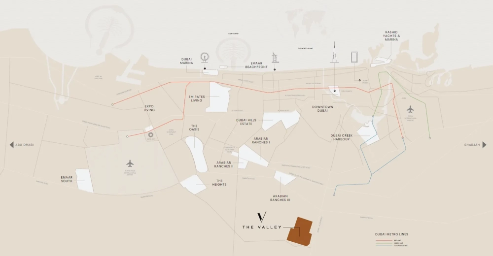

Nestled within lush greenery and the shade of indigenous Ghaf trees, Farm Grove embodies the essence of modern living in a self-sufficient, elegant community. With homes offering personalized options such as nature-inspired settings, landscaped gardens, and organic farming spaces, it provides an ideal blend of comfort and sustainability. Timeless architecture, eco-friendly materials, and spacious layouts ensure a lifestyle of sophistication and tranquility.

## **A Natural Flow of Luxury**

At Farm Grove, the seamless integration of outdoor beauty into daily life creates an unparalleled lifestyle experience. The serene landscape, adorned with Ghaf trees and verdant parks, offers a sanctuary for recreation and reflection. Winding pathways invite residents to explore lush green pockets, striking a perfect harmony between contemporary living and the natural world. This community fosters an atmosphere of freedom and connection to nature.

Farm Grove offers a nurturing environment where relationships thrive. With a lively community center, verdant expanses, and dedicated spaces for organic farming, it fosters a sense of togetherness. Conveniently located schools, shopping destinations, and eateries complete the picture of a connected neighborhood. Whether mingling with neighbors or retreating for solitude, Farm Grove provides the ideal space to balance social interaction with peaceful moments.

At Farm Grove in The Valley, the villas are thoughtfully designed for families to live in harmony with nature and each other. Choose from four- or five-bedroom homes featuring open-plan layouts that exude modern comfort. From designing a garden to adding a bespoke pool, these homes allow you to shape your living space into a personal sanctuary where you can truly thrive.

## **Timeless Design with a Contemporary Touch**

Residences at Farm Grove embody a fusion of classic and modern architectural styles. Clean lines, natural hues, and strategically placed glass elements create a visual masterpiece. The play of light against these features enhances the aesthetic appeal of every home, making them a perfect haven amidst the community’s verdant surroundings.

Every detail at Farm Grove is designed with precision and purpose. Floor-to-ceiling windows frame breathtaking views while allowing natural light to grace the interiors. This meticulous balance of timeless style and modern functionality creates a living space that is both inspiring and serene.

## **World-Class Amenities for a Vibrant Lifestyle**

Farm Grove is designed for joyful moments shared with loved ones. From community gardens to shaded play areas, the amenities foster wellness, relaxation, and fun. Highlights include:

- Kids’ play area

- Pet park

- Open lawns

- Fitness and sports center

- Community center

- Yoga platform

- Desert majlis

- Farming allotments

- Picnic areas

- Ghaf Forest

## **The Valley: A Visionary Town**

Welcome to The Valley, a visionary community by Emaar Properties, set amidst shimmering sands and green open spaces. This tranquil oasis in the UAE offers a unique blend of luxury and natural beauty. With state-of-the-art amenities and breathtaking landscapes, The Valley inspires innovation and exploration. Combining urban convenience with the charm of the desert, this community sets the stage for new opportunities and a lifestyle that celebrates both tradition and progress.
