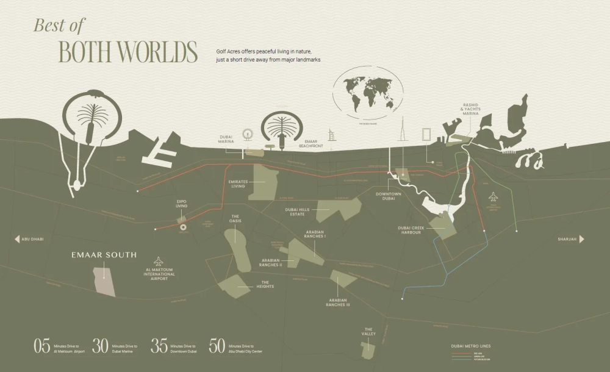

Golf Acres presents a thoughtfully curated lifestyle where modern architecture harmonizes with lush green landscapes to foster your well-being. Located in the vibrant Emaar South community, your residence is more than just a home—it is a sanctuary designed to soothe and inspire.

## **Inspired by Golf: A Life Beyond the Ordinary**

Immerse yourself in a lifestyle inspired by the elegance of golf at Golf Acres. Surrounded by pristine fairways and breathtaking landscapes, this is more than a residence; it’s an opportunity to celebrate the game and embrace a serene way of living. Whether honing your swing or simply enjoying the tranquil views, life at Golf Acres is a true testament to the beauty of the sport.

## **Reconnect, Recharge, and Thrive**

Golf Acres offers a tranquil escape for those seeking balance and rejuvenation. Take a refreshing dip in the pool, wander through landscaped gardens, or enjoy moments of reflection in serene natural surroundings. Here, every corner invites you to reconnect with nature and rediscover a sense of possibility.

## **The Heart of Emaar South**

Situated in the thriving Emaar South community, Golf Acres is enveloped by lush greenery and a championship golf course. This vibrant neighborhood boasts a selection of premium apartments and townhouses complemented by exceptional amenities, including hotels, retail outlets, healthcare facilities, educational institutions, and recreational options. From the moment you enter, the perfect blend of tranquility, striking views, and sophisticated architecture elevates everyday living.

## **Harmonious Design and Inviting Interiors**

The architectural design of Golf Acres seamlessly integrates contemporary elements with natural surroundings. The earthy tones of its exterior create a harmonious connection with the environment, while the interiors reflect a similar aesthetic, offering warm and inviting spaces. Each detail is meticulously crafted to nurture connection, relaxation, and enjoyment—a true reflection of modern elegance.

## **Residences Tailored to Your Needs**

Golf Acres features a selection of one to three-bedroom apartments and exclusive three-bedroom townhouses. These residences are complemented by a range of amenities, including:

- A stunning pool

- Lush gardens

- Inviting BBQ areas

- A dedicated kids' play area

The serene ambiance offers an ideal retreat, allowing residents to unwind and embrace the beauty of their surroundings. Living at Golf Acres is a celebration of refined living intertwined with natural tranquility.

## **World-Class Amenities**

Golf Acres provides a range of thoughtfully designed amenities that cater to all ages and lifestyles, including:

- An 18-hole championship golf course

- Adult and children’s swimming pools

- Outdoor gym facilities

- Yoga deck

- Jogging track

- Outdoor barbecue areas

## **Emaar South: A Thriving Community**

Discover the dynamic and rapidly evolving Emaar South, strategically located near Al Maktoum International Airport. This vibrant residential hub offers unparalleled connectivity and convenience, making it a sought-after destination in Dubai South. Blending luxurious living with lush green surroundings, Emaar South offers an unmatched lifestyle.

Whether enjoying a round of golf on the championship courses or relaxing in your elegantly designed home, the community embodies sophistication and comfort. With impressive infrastructure and exceptional amenities, Emaar South stands as a testament to Dubai’s transformation and growth. Here, modern living meets everyday ease, offering endless opportunities for fulfillment and success.
