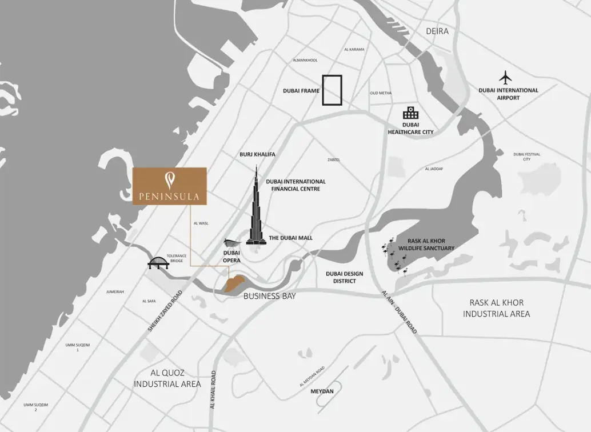

Every aspect of Jumeirah Living Business Bay is meticulously designed to offer an unparalleled branded living experience. With impeccable finishes and attention to detail, residents are immersed in breathtaking views of the Dubai Canal and Burj Khalifa.

This exclusive development provides a range of residential options, including two, three, and four-bedroom units, as well as five-bedroom simplex and duplex penthouses. Additionally, a full-floor master penthouse crowns the top level, each space showcasing a level of sophistication that sets a new standard in branded residences. Jumeirah Living Business Bay is anticipated to be completed by 2025.

## **Simplex & Duplex Penthouses: A New Height in Luxury**

The four and five-bedroom simplex and duplex penthouses are designed for those who seek the extraordinary. These residences, with their superior finishes and premium features, redefine sky-high living. They are carefully crafted to maximize the stunning views of the Dubai Canal and Downtown Dubai skyline, offering residents an exceptional living experience.

## **Full-Floor Penthouse: The Ultimate in Waterfront Luxury**

Occupying the entire 35th floor and spanning 9,656 square feet, this unique penthouse embodies the pinnacle of branded luxury in Dubai. It offers an expansive living space that includes five bedrooms, two maids' rooms, lavish living and dining areas, a library/study, gymnasium, sauna and steam room, and spacious balconies on both ends. These balconies provide 360-degree views of the Dubai Canal, Downtown Dubai, and the iconic Burj Khalifa.

## **Unparalleled Lifestyle at Jumeirah Living Business Bay**

Residents of Jumeirah Living Business Bay enjoy a lifestyle that is unmatched in the heart of Downtown Dubai. Managed by a world-renowned hospitality brand, known for its exceptional service and unique “Stay Different” ethos, residents have access to a range of wellness and entertainment experiences.

The development boasts a selection of luxurious amenities, including multiple swimming pools, a massage circuit pool, a lap pool, a yoga deck, a jacuzzi, sauna and steam rooms, and a fully equipped gymnasium with a personal training room and cinema. These amenities create a serene environment where residents can relax and unwind.

## **Amenities & Services: Curated for Elevated Living**

### **Five-Star Hospitality at Home**

Jumeirah Living Business Bay offers an elevated waterfront living experience, combining the elegance of five-star hospitality with the comfort of a private residence. Residents have access to a wide range of deluxe facilities and services, including concierge services, a resident’s lounge, a guest relations team, on-site residential management, security, housekeeping, and valet services. Additionally, a teenager lounge with gaming facilities and a co-study area ensures that all residents, including the younger generation, are well-catered for.

## **Prime Location: Seamlessly Connected to Dubai’s Landmarks**

### **A Hub of Connectivity**

<figure>

<figcaption>

#image\_title #separator\_sa #site\_title

</figcaption>

</figure>

Situated in the heart of Business Bay, one of Dubai’s most vibrant and cosmopolitan neighborhoods, Jumeirah Living Business Bay offers residents unparalleled connectivity to the city’s key destinations. Its prime location ensures easy access to Downtown Dubai, Dubai’s Old Town, and The Dubai Marina, allowing residents to enjoy the city’s most iconic landmarks with ease.

- Knowledge Village: 15.8 km (13 min by car, 40 min by metro)

- The Palm Jumeirah: 22 km (18 min by car)

- Emirates Golf Club: 19.6 km (16 min by car, 24 min by metro)

- Dubai International Airport: 22 km (11 min by car, 26 min by metro)

- Burj Khalifa/Dubai Mall: 2 km (6 min by car, 6 min by metro)

- Dubai Downtown: 3.7 km (8 min by car, 18 min by metro)

- Mall of the Emirates: 11.4 km (9 min by car, 12 min by metro)

- DIFC: 5.4 km (10 min by car, 34 min by metro)

- Jumeirah Beach: 4.8 km (7 min by car)
