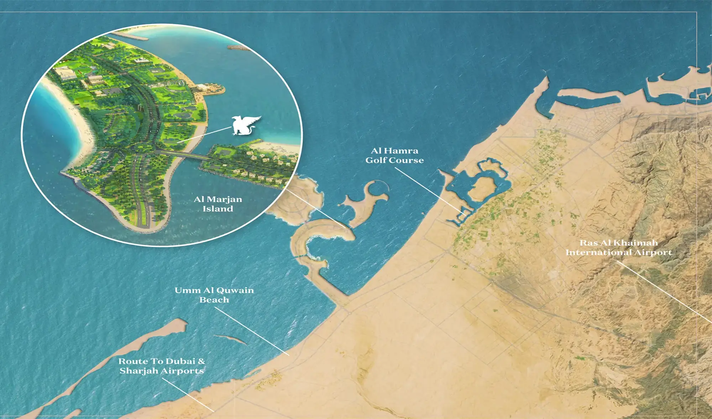

**Introducing JW Marriott Residences Ras Al Khaimah, a pinnacle of luxury living on Al Marjan Island.**

This exclusive development, designed by renowned architect Tony Ashai, offers an unparalleled residential experience. Select from a range of exquisite homes, including one to three-bedroom apartments, three-bedroom duplexes, and premium four-bedroom penthouses. Each residence is meticulously crafted with modern aesthetics and spacious layouts.

Beyond the stunning architecture, residents can indulge in a plethora of world-class amenities. From six diverse dining experiences and a rejuvenating spa to a state-of-the-art fitness center and multiple swimming pools, every comfort is catered to. The elevated sandy beach, complete with an infinity pool, offers a serene escape, while the vibrant nightlife and retail options ensure an exciting lifestyle.

## **Prime Location at Al Marjan Island**

Situated adjacent to the upcoming Wynn Resorts Al Marjan Island, the project benefits from a prime location. Residents enjoy breathtaking sea views and convenient access to the mainland via Al Marjan Island Blvd. Ras Al Khaimah International Airport is a short 30-minute drive away.

JW Marriott Residences presents an exceptional investment opportunity with its attractive payment plan and freehold ownership. This, combined with the growing allure of Ras Al Khaimah as a tourist destination, makes it a compelling proposition for discerning investors.

## **Key Features**

- Exclusive beachfront residences

- Designed by renowned architect Tony Ashai

- A wide range of apartment and penthouse options

- Unparalleled amenities and services

- Prime location on Al Marjan Island

- Strong investment potential
