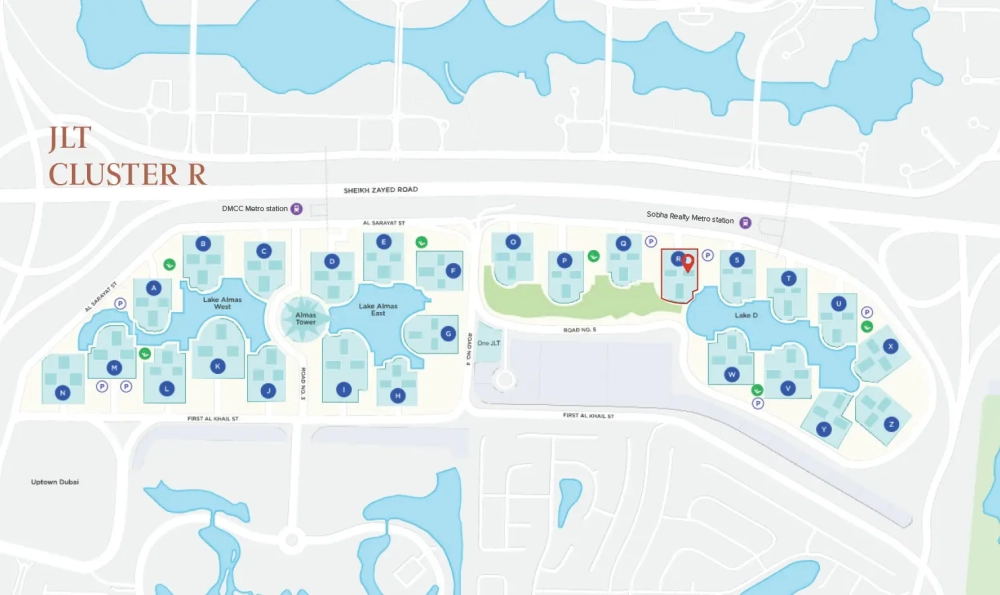

MBL Signature elevates the concept of sophisticated living, offering an unmatched blend of luxury and functionality. Featuring a selection of meticulously designed studios and one- and two-bedroom apartments, residents enjoy breathtaking views of the iconic Marina skyline. Strategically located in one of Dubai's most desirable areas, this residential masterpiece ensures seamless connectivity with its proximity to the metro and nearby parks. MBL Signature isn't just a residence—it’s a lifestyle that inspires brighter futures and joyous living.

## **Envision Your Future with Stunning Views**

Experience daily serenity with the captivating vistas of the iconic Marina skyline. MBL Signature offers a front-row seat to one of Dubai’s most scenic views, ensuring that every moment spent at home is infused with tranquility and inspiration.

MBL Signature is a landmark of architectural brilliance, designed to harmonize elegance and functionality. The building’s sleek exterior enhances Dubai’s dynamic skyline, while expansive windows flood interiors with natural light and sweeping views.

Every detail in the residences has been carefully curated, featuring spacious layouts, opulent finishes, and premium materials that speak to the highest standards of craftsmanship. From the grand entrance to the intricate interior touches, MBL Signature is a symphony of aesthetic beauty and practical luxury, redefining timeless sophistication.

## **Extraordinary Living Spaces**

At MBL Signature, every detail embodies unapologetic luxury. Designed for discerning individuals with a flair for bold style, the interiors boast exquisite finishes, premium materials, and sophisticated furnishings. This is a space where elegance seamlessly blends with confidence, creating an ambiance that celebrates vibrant, dynamic lifestyles.

## **JLT: The Global Hub for Trade and Innovation**

Jumeirah Lakes Towers (JLT) is home to the Dubai Multi Commodities Centre (DMCC), the world’s most interconnected Free Zone. With over 20,000 businesses and a community of 100,000 residents, JLT offers an unparalleled mix of industry, innovation, and lifestyle.

Key offerings include:

- **Global Trade Opportunities:** Support for importing and exporting diverse products.

- **Diamond Trading Excellence:** The world’s third-largest diamond trading hub, connecting producers and consumers.

- **Business-Friendly Environments:** Co-working spaces and digital platforms tailored for enterprises.

- **Tech and Crypto Innovation:** A Google-partnered tech center fostering digital transformation.

## **Transforming Living with Smart Solutions**

In partnership with Etisalat Digital, DMCC is making JLT the first smart and sustainable district in the region, powered by a 5G network. This initiative aims to enhance residents' and visitors' quality of life through advanced technology, improving safety, reducing health risks, and boosting sustainability.

## **Prime Connectivity and Lifestyle Opportunities**

MBL Signature is at the heart of a vibrant neighborhood, with premier attractions and destinations just minutes away:

- Dubai Marina (6 min.)

- JBR (7 min.)

- Palm Jumeirah (11 min.)

- Burj Al-Arab (15 min.)

- Abu Dhabi (45 min.)

## **Community Living at Its Best**

Residents of JLT enjoy a balanced lifestyle with access to a wealth of amenities, including leisure, retail, hospitality, dining, and outdoor sports. Its prime location offers unparalleled connectivity to Dubai's major attractions, beaches, shopping centers, and metro stations.

## **World-Class Facilities and Amenities**

At MBL Signature, every element is designed to provide a luxurious and convenient lifestyle. Residents can indulge in:

- Infinity Pool

- Kids' Area

- Health Club & Gym

- Food Court

- BBQ Area
