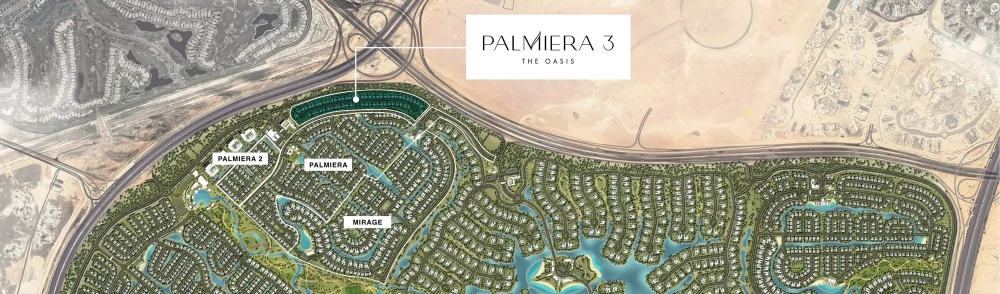

Palmiera 3 transcends the conventional concept of a home, presenting itself as a sublime expression of lifestyle, carefully curated for those who appreciate true luxury. With each dawn, experience the symphony of nature’s finest elements. Explore the captivating trails of linear parks, unwind in the serene waters of swimmable lagoons, or challenge yourself in our cutting-edge gymnasium.

## **Prime Location, Perfect Connection**

Situated within The Oasis, Palmiera 3 offers an exceptional location that seamlessly bridges the gap between the vibrant energy of Dubai and the tranquility of nature. Positioned near key transport routes like Sheikh Zayed bin Hamdan Road (D54) and the upcoming extension of Al Khail Road (E44), this strategic locale ensures convenient access to the city's dynamic attractions while providing a peaceful retreat from the hustle and bustle. Whether you seek the thrill of urban life or the calm of nature, Palmiera at The Oasis delivers the ideal balance.

## **A Retreat of Elegance and Serenity**

Step away from the city’s fast-paced rhythm and into the serene embrace of Palmiera 3 at The Oasis. This exclusive residential community offers a peaceful retreat within Dubai’s vibrant landscape, with a collection of luxurious villas designed to provide an unmatched sense of tranquility. Here, the harmony of nature meets exceptional design, creating an environment where residents can indulge in both beauty and relaxation.

## **The Oasis: Emaar’s Masterpiece**

The Oasis by Emaar stands as a monumental achievement in Dubai’s real estate landscape, sprawling over 100 million square feet (9.4 million square meters) of unparalleled grandeur. This expansive development features over 7,000 residences, including majestic super-mansions, mansions, and spacious villas, each offering panoramic views of serene water canals, sparkling lakes, and lush parks. Designed by world-renowned architects and designers, The Oasis sets a new benchmark for luxurious waterfront living.

At Palmiera 3, the 4-bedroom villas are a testament to thoughtful design and an effortless connection with the surrounding nature. These homes are crafted to enhance comfort and well-being, with layouts that maximize views of the water canals and landscaped areas. The interiors exude modern elegance, featuring high-quality materials and finishes that create an inviting and sophisticated atmosphere.

## **Community and Lifestyle**

Palmiera 3 offers a range of meticulously designed amenities that foster a vibrant community life. The exclusive community center serves as a hub for social and active engagement, featuring swimmable lagoons, a multipurpose room, a gymnasium, and wellness areas. These spaces are crafted to provide high-quality environments for relaxation, entertainment, and maintaining a healthy lifestyle.

Immerse yourself in unparalleled luxury at The Oasis by Emaar, a sanctuary set amidst lush greenery and tranquil waterways. The meticulously designed residences, including grand mansions and villas, are the work of world-renowned architects and designers, offering seamless indoor-outdoor living with an array of world-class amenities. The Oasis is not merely about refined waterfront living; it represents the pinnacle of elegance and comfort. Every moment here is a celebration of life, with personalized services catering to your every need, making every day an occasion for indulgence and relaxation. Welcome to The Oasis, where your journey to unmatched sophistication begins. Enjoy effortless luxury and timeless charm in a place that feels like home.

### **Key Features**

- **Total Land Area**: 100 million sq ft

- **Residential Units**: Over 7,000

- **Open Spaces and Amenities**: 25% of the land

- **Golf Courses**: 4 international golf courses in close proximity
