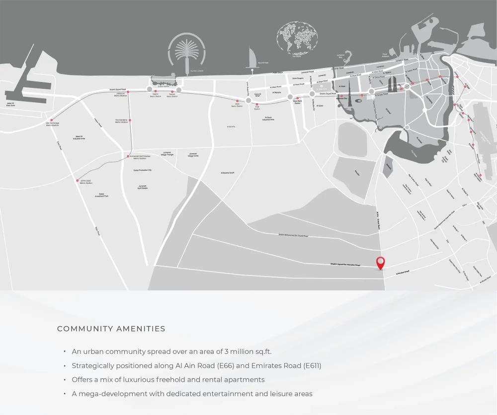

Samana Ibiza is a standout residential project developed by Samana Developers, located in the vibrant DLRC district of Dubailand. This impressive 20-floor structure is designed to provide modern, elegant living spaces, ideal for individuals seeking both comfort and sophistication. Offering luxurious studio, 1-bedroom, and 2-bedroom apartments, the development promises a resort-style living experience with every unit featuring a private pool. Studio apartments, starting from 485 sqft (45 m²), while larger 1-bedroom and 2-bedroom units offer ample living space with sizes of 860 sqft (80 m²) and 1,185 sqft (110 m²), respectively. The range of apartment sizes, coupled with flexible payment plans, makes Samana Ibiza an attractive option for both investors and homeowners.

## **Architectural Excellence and Smart Living**

Architecturally, Samana Ibiza blends modern aesthetics with functional design. The building’s sleek, contemporary exterior complements the stylish and comfortable interiors, which feature neutral tones and high-quality materials. Each apartment is designed to feel open and inviting, with large windows that let in natural light and highlight the refined finishes. In addition, every unit comes equipped with built-in kitchen appliances and integrated smart home systems, offering residents the convenience of controlling lighting, temperature, and security with a touch of a button. These smart features are thoughtfully incorporated to enhance everyday living.

## **Resort-Style Amenities**

Samana Ibiza is designed to offer residents an unparalleled resort-style lifestyle. Each apartment features a private pool, ensuring a level of luxury and privacy that is rare in Dubai’s real estate market. Beyond the private pools, the development offers an array of top-tier amenities, including valet parking, 24/7 concierge services, lush green spaces, a large pool deck, an outdoor cinema, and a state-of-the-art gym. Wellness facilities such as a steam room, sauna, and waterfall features further contribute to the project's focus on relaxation. For fitness enthusiasts, an outdoor gym, jogging track, and expansive green areas provide ample opportunities for recreation and exercise.

## **Prime Location with Easy Connectivity**

Situated in Dubailand, Samana Ibiza provides convenient access to Dubai’s major destinations. Residents are just 5 minutes from Zayed University and GEMS School, 10 minutes from IMG Worlds of Adventure, and 15 minutes from Global Village. The development is also located only 20 minutes from Dubai International Airport, and 25 minutes from both Dubai Mall and the Burj Khalifa. This prime location makes Samana Ibiza an ideal option for families and professionals who value connectivity and accessibility to key parts of the city.
