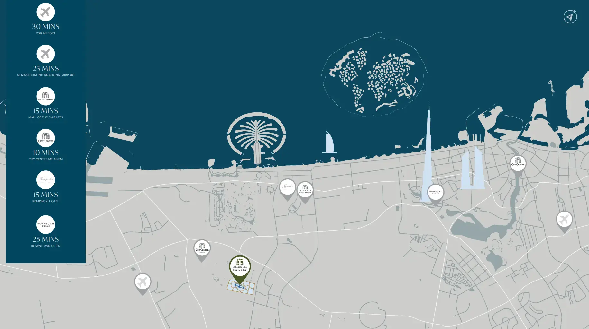

The Serenity Mansions Waterfront Collection at Tilal Al Ghaf represents the pinnacle of luxury living in Dubai. Featuring premium six-bedroom mansions developed by Majid Al Futtaim, this exclusive community showcases exceptional architectural design by globally acclaimed collaborators, Saota and Blink. The design seamlessly integrates modern aesthetics with natural elements, fostering a harmonious and tranquil living environment. Nestled along serene waterfronts, these mansions offer an idyllic retreat from the city's hustle, complemented by world-class amenities and excellent connectivity.  

## **A Prime Location for a Lifestyle Beyond Compare**

Situated in the vibrant Tilal Al Ghaf community, the mansions enjoy a prime location that combines contemporary urban living with lush green surroundings. This thoughtfully planned locality offers a dynamic lifestyle, with the stunning lagoon and sandy beach areas forming the heart of the community. Spanning nearly 500,000 square meters, the neighborhood is adorned with expansive parks, tree-lined walkways, and open green spaces, all designed to provide a serene and active lifestyle amidst nature.  

The Waterfront Collection epitomizes luxury and sophistication, offering not just residences but a testament to refined living. With cutting-edge architecture, opulent interiors, and breathtaking views, these mansions redefine bespoke living. Each home is designed with expansive living spaces, soaring ceilings, and floor-to-ceiling windows that frame the lagoon and lush landscapes. The craftsmanship reflects meticulous attention to detail, allowing for extensive customization to match the unique preferences and personalities of residents.  

## **Artistic Interiors Inspired by Global Icons**  

Step inside, and you are greeted with interiors inspired by the world’s most iconic art galleries. Homeowners can select from two distinctive design palettes, Kai and Fay, each offering a unique blend of textures, colors, and materials. Kai exudes urban energy with bold expressions, while Fay embraces serenity, inspired by the natural world. These curated designs create the perfect canvas for showcasing personal art collections, furniture, and cherished memories.  

For further customization, the interior design options expand with the Earth and Ash palettes. Earth incorporates warm, natural tones for a cozy and inviting ambiance, while Ash presents a cool, minimalist aesthetic for a modern and sleek look. Additional design themes, Moma and Uffizi, allow homeowners to craft a space that truly reflects their individuality.  

## **A Community Built for Wellness and Convenience**  

The community at Tilal Al Ghaf is designed to promote a healthy, active lifestyle with 18 kilometers of walking trails and 11 kilometers of cycling and jogging paths. A plethora of amenities, including world-class dining experiences, premium retail outlets, and top-tier leisure and entertainment options, are within walking distance. Residents also benefit from proximity to an internationally recognized school, ensuring all aspects of life are conveniently catered to.  

## **Key Features and Highlights**  

- **Tailored Luxury:** Personalize your six-bedroom mansion with bespoke design options that reflect your lifestyle and preferences.  

- **Prime Waterfront Location:** Located in Tilal Al Ghaf, offering seamless connectivity and direct access to the lagoon, beachfront, and verdant surroundings.  

- **Striking Styles:** Choose between two unique mansion styles—Kai, inspired by urban energy, and Fay, a serene sanctuary influenced by nature.  

- **Art-Inspired Interiors:** Select from the artistic palettes, Earth and Ash, inspired by globally renowned art galleries, each with a distinct character.  

- **World-Class Collaboration:** Architectural excellence brought to life by Saota and Blink, celebrated for their expertise in luxury design.  

- **Indoor-Outdoor Harmony:** Seamless integration of open lounges and unobstructed garden views enhances the living experience.  

- **Comprehensive Amenities:** Enjoy fine dining, signature retail, and luxury leisure options within a walkable neighborhood.  

With its meticulous attention to detail and unparalleled design, Serenity Mansions Waterfront Collection is more than a place to live—it is a statement of luxury, artistry, and individuality.
