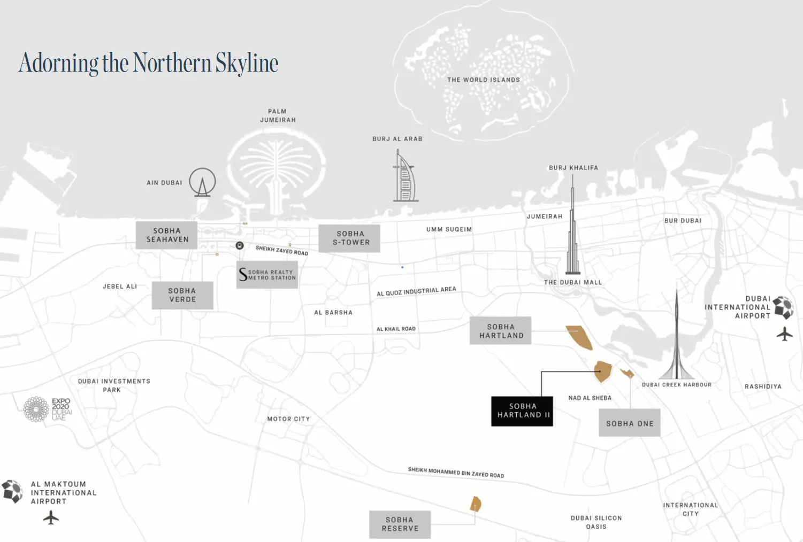

Skyvue Solair Stands As The Inaugural Masterpiece Of The Esteemed Skyvue Cluster, Heralding A Future Of Limitless Possibilities. This Iconic 58-Story Tower Offers A Curated Selection Of 1, 1.5, And 2-Bedroom Residences, Seamlessly Blending Contemporary Luxury With Unparalleled Amenities. Positioned At The Heart Of Sobha Hartland Ii, The Development Provides Residents With Breathtaking Views Of Serene Lagoons And Dubai’S Dynamic Skyline, Catering To Refined Tastes And Modern Sensibilities.

## **A Lifestyle Designed for Passion and Elegance**

As the epitome of evolving luxury, Skyvue Solair transforms the concept of opulent living. At its core lies a stunning amphitheater set against adaptive water levels, complemented by a vibrant community teeming with life. Residents can enjoy gourmet dining, open-air theaters, barbecue zones, sensory gardens, and picturesque cycling paths. Every aspect of this development is thoughtfully crafted to create experiences that inspire joy and fulfillment, ensuring each day feels like an extraordinary celebration of life.

## **Architectural Excellence and Unmatched Sophistication**

Rising majestically against Dubai’s northern skyline, Skyvue Solair redefines urban luxury with its rhythmic zig-zag façade and innovative triangular floor designs. These architectural features enhance the flow of natural light and offer panoramic views, merging functionality with artistic brilliance. Meticulously crafted, the residences embody modern sophistication, providing a tranquil haven while pulsating with the vibrancy of urban life.

## **An Idyllic Community in Sobha Hartland II**

Nestled within the expansive 8-million-square-foot Sobha Hartland II community, Skyvue Solair offers a harmonious blend of nature and luxury. Strategically positioned, the development ensures seamless connectivity to Dubai’s iconic landmarks, including Downtown Dubai, the Burj Khalifa, Dubai Opera, and Meydan Racecourse. Despite its proximity to the city’s bustling core, the community serves as a serene retreat, featuring lush landscapes, crystal-clear lagoons, and shaded tree-lined pathways.

## **Panoramic Views: A Gateway to Dubai's Grandeur**

Every residence at Skyvue Solair is designed to offer unobstructed views, stretching from the vibrant heart of Downtown Dubai to the peaceful Ras Al Khor Wildlife Sanctuary. These awe-inspiring vistas underscore the diversity and beauty of Dubai’s skyline, creating an ever-evolving tapestry of urban and natural magnificence. At the center of it all is a captivating water feature surrounded by curated dining experiences, forming a dynamic amphitheater-like setting ideal for social gatherings and memorable moments.

## **Elevated Amenities for a Refined Lifestyle**

Skyvue Solair is more than a residence—it’s an experience. The development boasts an extensive range of amenities that cater to diverse passions and lifestyles. From sensory gardens and open-air cinemas to state-of-the-art fitness centers and meditation lounges, every space is designed with meticulous attention to detail. Whether hosting a barbecue on the party terrace, indulging in an infinity pool, or exploring the central water feature, residents can embrace a lifestyle of unparalleled luxury.

## **Key Highlights**

- Residences: Thoughtfully designed 1, 1.5, and 2-bedroom apartments with superior craftsmanship and modern elegance.

- Prime Location: Situated within Sobha Hartland II, offering easy access to key destinations like Downtown Dubai and Meydan Racecourse.

- Architectural Brilliance: The tower’s zig-zag façade and triangular floor plan maximize natural light and offer panoramic views.

- Nature Meets Urban: A tranquil retreat combining natural serenity with the convenience of city living.

- Stunning Views: Unobstructed vistas of Dubai’s iconic skyline and the Ras Al Khor Wildlife Sanctuary.

- World-Class Amenities: Infinity pools, yoga zones, music rooms, executive lounges, sensory gardens, and more.

Skyvue Solair at Sobha Hartland II is where architectural innovation meets luxury living, offering residents a perfect blend of urban vibrancy and natural tranquility. This is not just a home—it’s a lifestyle reimagined.
