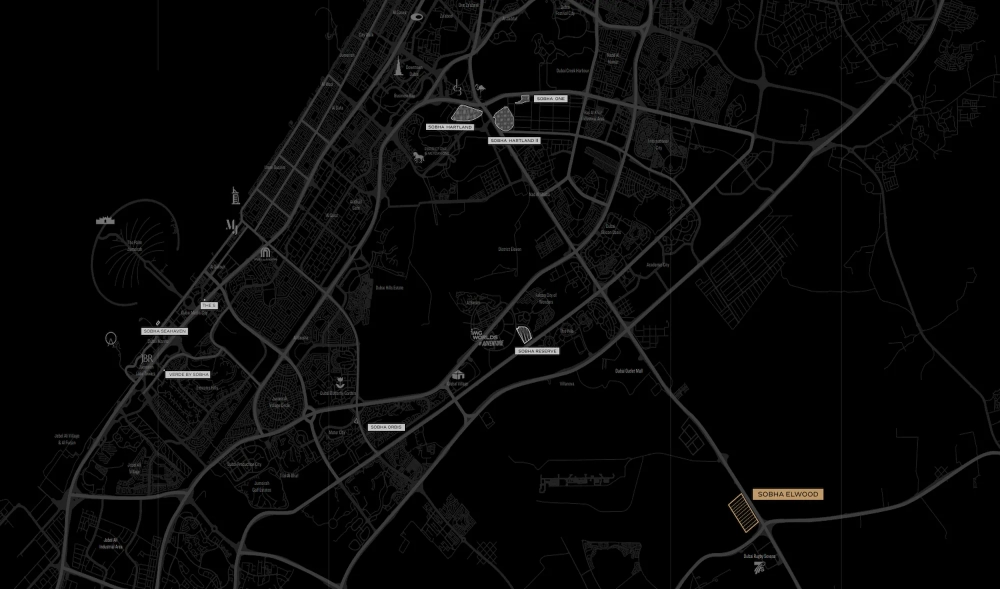

Immerse yourself in a unique blend of luxury and nature at Sobha Elwood, Dubai's latest off-plan development. This exquisite collection of 4, 5, and 6-bedroom villas is nestled within a serene sanctuary, offering an unparalleled living experience. Spanning 416,000 square meters, the lush community will be home to over 10,000 trees, drawing inspiration from some of the world's largest forests.

## **Crafting a Lifestyle of Comfort and Elegance**

Each villa at Sobha Elwood is meticulously designed to offer a harmonious balance of comfort and luxury. With modern layouts, premium materials, and high-end finishes throughout, these homes provide the perfect setting for families to create lasting memories. Choose the villa that best suits your lifestyle and prepare to embrace a new way of living.

## **Your Personal Oasis of Nature**

Sobha Elwood offers a range of exclusive amenities that elevate the living experience. Residents can enjoy a swimming lagoon, Padel courts, a Wadi clubhouse, and expansive green spaces. Additional features include community gardens, an Elwood trail, open fitness areas, and dedicated wellness zones, all providing a peaceful retreat with convenient access to Dubai's main attractions.

## **Amenities**

- Lap pool

- Yoga lawn

- Multi-purpose room

- Fitness centre & outdoor gym

- Barbecue area & multipurpose lawn

## **Prime Location with Unmatched Convenience**

Located in Dubailand, Sobha Elwood offers easy access to some of Dubai’s key destinations:

- 5 minutes to Dubai Rugby Sevens

- 8 minutes to Dubai Outlet Mall

- 20 minutes to Downtown Dubai

- 25 minutes to Dubai International Airport

- 30 minutes to Al Maktoum International Airport

## **Key Highlights**

- Choose from elegantly designed 4, 5, and 6-bedroom villas, each offering a seamless blend of modern sophistication and natural beauty.

- Spacious interiors, large windows, and earthy tones create a harmonious connection with the surrounding nature.

- The community features over 10,000 trees and expansive landscaped parks, providing a serene environment ideal for relaxation and outdoor activities.

- Residents enjoy exclusive access to a premium clubhouse with a fitness center, spa, and social spaces.

- Family-oriented facilities include dedicated play areas, an on-site school, clinic, and daycare.

- Dive into a range of water sports options, including a lap pool and a splash pad for children.

Don’t miss the opportunity to secure your dream home. Contact us today to reserve your preferred unit.
