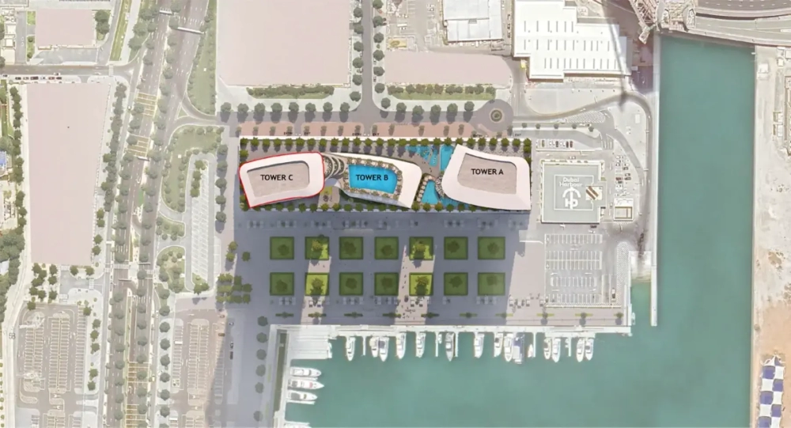

Sobha SeaHaven is a premier sea-facing development located in the vibrant Dubai Harbour, offering ultra-luxury apartments with 1 to 4 bedrooms. Boasting exquisite amenities and lush green landscapes, it provides a sanctuary of elegance, tranquility, and scenic beauty. Positioned strategically at a key maritime gateway, Sobha SeaHaven allows residents to effortlessly explore the most sought-after destinations in the region.

## **Breathtaking Views of Iconic Landmarks**

Nestled in the heart of Dubai Harbour, Sobha SeaHaven presents an awe-inspiring vista of some of Dubai’s most cherished landmarks, including Ain Dubai, Palm Jumeirah, the Marina skyline, and the expansive ocean horizon. These iconic views are seamlessly integrated into the luxurious living experience.

## **Prime Location with Iconic Connections**

Every day begins with unparalleled views of the Palm Jumeirah, Ain Dubai, and the sparkling Marina skyline. Adding to the allure are glimpses of the iconic Burj Al Arab and the serene Arabian Gulf.

This prime location ensures seamless access to a host of world-class amenities, including luxury shopping destinations, gourmet dining options, and premium entertainment venues. Here, Dubai’s most celebrated landmarks are not just nearby—they are part of your daily life.

## **Exceptional Amenities for Modern Living**

Sobha SeaHaven is designed with the finest details to enhance your lifestyle:

- Luxurious Interiors: Leatherette and rich veneer-finished wardrobes.

- Spacious Design: Floor-to-floor height of 3.6 meters.

- Smart Living: Home automation systems and flexible track lighting.

- State-of-the-Art Kitchens: Fully fitted kitchens equipped with premium appliances.

- Advanced Sanitation: Smart WC systems for added convenience.

## **Unmatched Proximity to Key Destinations**

Living at Sobha SeaHaven places you close to essential attractions and facilities:

- Two international airports.

- A retail mall and fine dining establishments.

- The International Cruise Terminal and Ain Dubai.

- Public beaches, leisure hotspots, and world-class entertainment.

- A fully equipped marina and harbour.

Sobha SeaHaven is not just a residence; it is a lifestyle that epitomizes luxury and connectivity at its finest.
