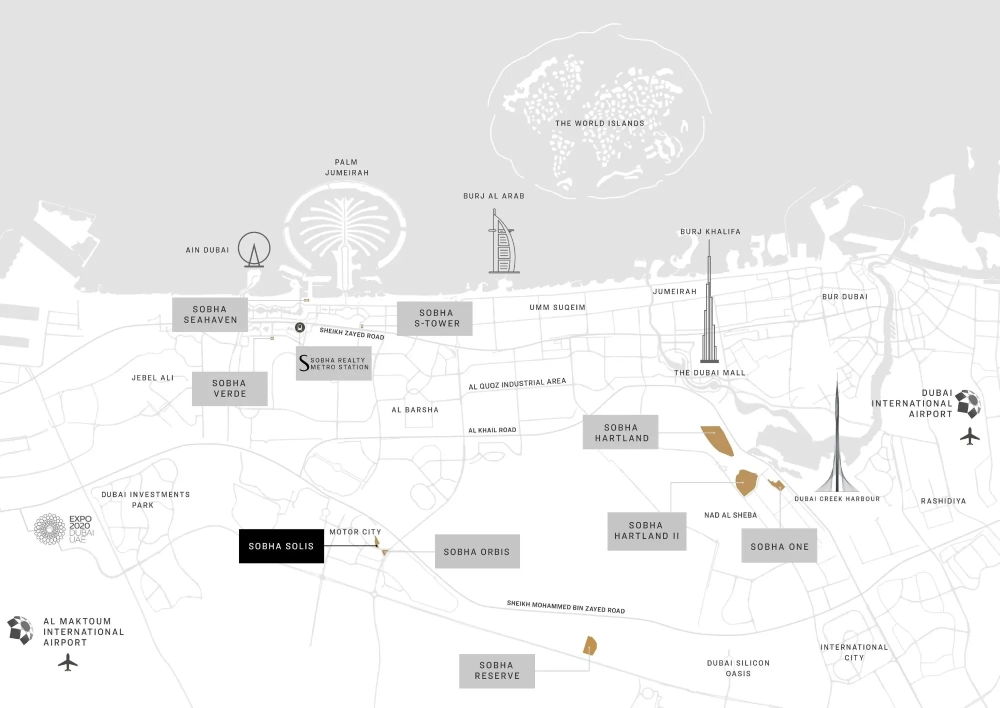

Discover a unique blend of luxury and adventure in this urban retreat. This exclusive community features a range of 1 to 3-bedroom residences, beautifully situated across four distinct towers. Each tower is interconnected by a shared podium, designed solely for residents. The apartments boast spacious layouts, large windows, and private balconies, filling your home with an abundance of natural light and offering captivating views. Immerse yourself in the lush greenery of vibrant gardens and the dynamic excitement of the nearby racetrack, all while enjoying the serenity of your private space.

## **Explore Modern Amenities**

Indulge in a variety of world-class amenities that elevate your lifestyle. From indoor racetrack viewing decks and a lap pool to an outdoor cinema and sunken pool deck, there is something for everyone. Whether you're looking to relax at the sports bar, entertain at the seating court, or enjoy the interactive play fountain, every detail is designed to cater to your diverse interests.

## **Quiet Luxury at Motor City, Dubai**

Motor City is known for its energy and vitality, but the constant background noise can sometimes disrupt the peaceful environment you desire at home. Understanding this, Sobha Realty has collaborated with an acoustic expert to enhance the soundscape of your living space. By transforming the lively buzz of the community into a calming atmosphere, we ensure that your home becomes the tranquil refuge you deserve. Experience the serene luxury of a quiet, comfortable home, where the gentle sounds of nature replace the noise of the outside world.

## **A Sanctuary for Wellness**

At Sobha Solis, we cater to both the mind and spirit. Book lovers will find joy in our carefully curated library, while nature enthusiasts can unwind in our beautifully landscaped zen gardens and jogging paths. Our dedicated Yoga and Meditation Zone within the indoor gym provides a space for introspection, allowing you to reconnect with yourself and rejuvenate your soul. Whether you're engaging in mindful practice or simply seeking peace, this tranquil environment is designed to promote balance and inner harmony.

## **A Perfect Location**

Positioned in the heart of the city, this community offers easy access to some of Dubai's most popular destinations:

- 1 minute to Dubai Autodrome

- 15 minutes to Dubai Hills Mall

- 20 minutes to Global Village and Mall of the Emirates

- 27 minutes to Palm Jumeirah

- 32 minutes to Dubai International Airport

## **Additional Features**

- Club lounge and creative zone

- Arsenal-branded fitness centre

- Retail shops and dining outlets

- Kid's play area and supermarket

- Zen garden and barbecue areas

With these modern conveniences and thoughtfully designed spaces, this urban sanctuary ensures that every aspect of your lifestyle is catered to, offering a balanced and luxurious living experience.
