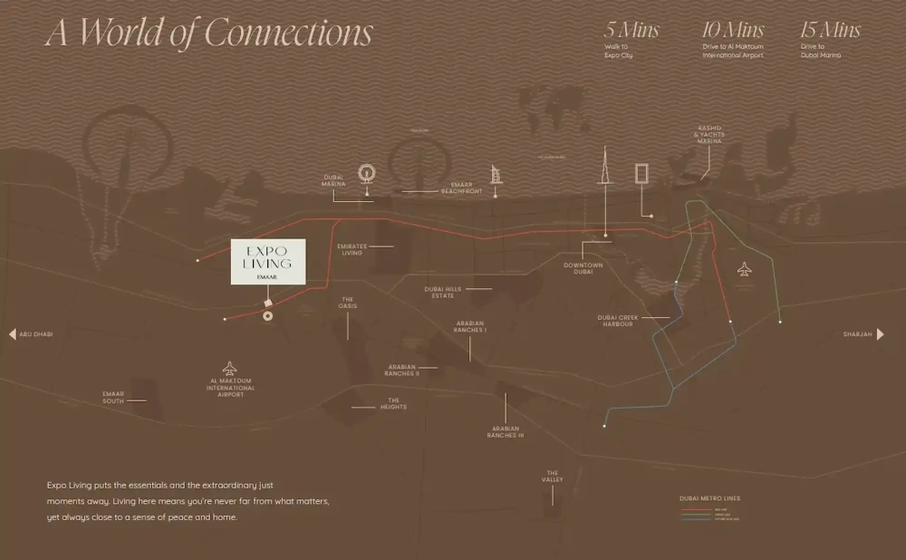

Nestled in the vibrant Expo Living community at Expo City, Terra Heights redefines contemporary living with its thoughtful design and inviting atmosphere. Strategically located near Dubai’s Al Maktoum International Airport, it offers a harmonious blend of modern architecture, lush courtyards, and community-focused spaces where neighbors naturally connect.

From the warm embrace of natural light filling your home to the dynamic energy of Expo City just steps away, Terra Heights provides a grounded lifestyle while keeping you poised for what’s next.

## **Location and Accessibility**

Terra Heights offers a lifestyle where convenience meets serenity. Situated within a short 15-minute walk to Expo City, a 15-minute drive to Al Maktoum International Airport, and just 25–30 minutes from Palm Jebel Ali, it keeps you effortlessly connected to Dubai’s most dynamic destinations. Whether you’re seeking essentials or extraordinary experiences, this community ensures you’re always close to what matters most while maintaining a peaceful, home-like atmosphere.

## **Amenities and Lifestyle**

Life at Terra Heights is designed for exploration, connection, and relaxation. As part of Expo Living, the community includes a modern retail mall and a diverse amenity platform to enhance daily living. With its proximity to Expo City and Al Maktoum International Airport, Terra Heights seamlessly balances global connectivity with local comfort, offering residents a thoughtfully crafted community to call home.

## **An Ideal Base for Adventure**

Expo Living is a forward-thinking community set in the vibrant landscape of Dubai South. Situated near Expo City, poised to become the region’s premier hub for exhibitions and events, and conveniently close to Al Maktoum International Airport, this community is perfect for those who value global connections alongside tranquil living.

Expo Living features sprawling parks, serene ponds, and a metro station nearby, all complemented by the world-class Expo Mall for retail and entertainment. This makes it an ideal choice for individuals and families seeking a balanced lifestyle that combines adventure with ease.

## **Architecture and Layout**

Terra Heights stands out with its clean, modern lines and practical layouts, blending seamlessly into the surrounding environment. Comprising four mid-rise buildings thoughtfully arranged around two serene courtyards, the development fosters connections—with nature, neighbors, and oneself.

## **Homes Tailored for Comfort**

Offering a mix of one- and two-bedroom apartments, Terra Heights prioritizes smart, open layouts that maximize natural light and optimize space. Residents enjoy views of either the vibrant Expo City or the lush green courtyards within the development.

## **Amenities: Designed for Every Moment**

The podium-level courtyard at Terra Heights serves as a community hub, featuring landscaped gardens and inviting spaces for relaxation or socializing. Whether it’s morning yoga, an afternoon swim, or an evening barbecue, the amenities cater to every part of your day.

- Adult and kids’ pools

- Outdoor play areas for children

- Fully equipped gym

- Yoga deck for relaxation

- Multipurpose sports courts

- Community lawn for gatherings

- Barbecue facilities for social evenings

- Event and meeting rooms
