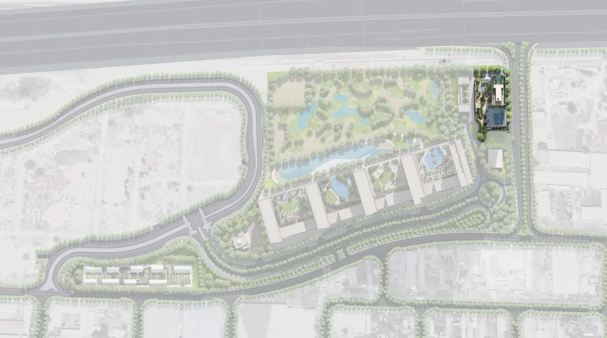

The Element at Sobha One, an exclusive residential project by Sobha Realty, is situated in the prestigious Sobha Hartland community. This 69-story high-rise features a sleek glass façade and embodies a minimalist design that exudes sophistication. Its architectural concept maximizes natural light, allowing residents to enjoy breathtaking views of Downtown Dubai, Dubai Creek Harbour, Ras Al Khor Wildlife Sanctuary, and a private golf course.

## **Elegant Living Spaces**

Offering a selection of stylish 1 to 4-bedroom apartments, The Element at Sobha One presents residences ranging from 729 sq. ft. (68 m²) to 2,445 sq. ft. (227 m²). The interiors are crafted in refined, neutral tones, incorporating premium natural materials and contemporary design elements. These residences are thoughtfully designed with high ceilings, panoramic windows, and minimalist finishes featuring natural stone and glass. Every aspect, from built-in storage solutions to soft ambient lighting, is meticulously planned to enhance both comfort and functionality. The Element at Sobha One reflects Sobha Realty’s vision of blending elegant style, modern innovations, and sustainability.

## **Exceptional Amenities for an Elevated Lifestyle**

Residents of The Element at Sobha One will have access to an extensive array of world-class amenities. The development features infinity pools with lounge areas, a state-of-the-art gym with a dedicated cardio zone, and spaces for yoga and Pilates. Additionally, a luxurious spa complex and indoor relaxation areas provide the perfect retreat. Families can enjoy dedicated children’s playgrounds, barbecue areas, a co-working space, and a library. Fitness enthusiasts will appreciate the inclusion of CrossFit zones, jogging tracks, and both indoor and outdoor sports facilities. One of the standout features of the development is the exclusive 18-hole Pitch & Putt golf course, a rarity among residential communities in Dubai.

## **Prime Location with Seamless Connectivity**

Located in the thriving Sobha Hartland community, The Element at Sobha One offers the perfect blend of tranquility and urban convenience. Residents can enjoy a peaceful environment while being just minutes away from the city’s vibrant hubs. Dubai Creek Harbour is a mere five-minute drive, while Downtown Dubai and Business Bay can be reached within 15 minutes. Palm Jumeirah is accessible in 25 minutes, and Dubai International Airport is just 15 minutes away. The area is well-developed with essential infrastructure, including reputable international schools such as Hartland International and North London Collegiate, healthcare centers, shopping boutiques, and supermarkets. Additionally, nature lovers will appreciate the proximity to Ras Al Khor Wildlife Sanctuary, where they can witness stunning landscapes and rare bird species in their natural habitat.

## **A Lucrative Investment Opportunity**

Investing in The Element at Sobha One presents a highly promising opportunity. Sobha Hartland is rapidly developing, and the demand for premium residential properties continues to rise. Currently, rental yields in the area range between 6-8% per annum, with strong potential for capital appreciation as the supply remains limited. Prospective buyers can benefit from a flexible payment plan, with 60% of the property value payable during construction and the remaining 40% upon handover. The completion of The Element at Sobha One is scheduled for Q4 2028, making it an ideal choice for investors looking to capitalize on Dubai’s thriving real estate market.
