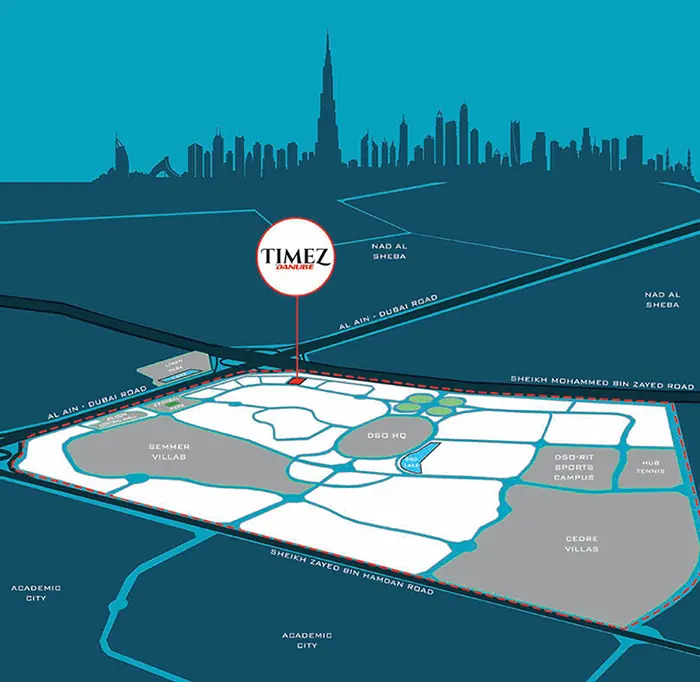

Danube Properties introduces Timez, a contemporary residential development situated in Dubai Silicon Oasis (DSO). This project offers a selection of elegantly designed studios, as well as one- to three-bedroom apartments. Certain units also feature private swimming pools, enhancing the luxury living experience.

Timez by Danube at Dubai Silicon Oasis boasts a sleek, modern architectural design, featuring high-glass facades and floor-to-ceiling windows that allow an abundance of natural light. The interiors are inspired by the Art Nouveau style, incorporating minimalist forms, eco-friendly materials, and ergonomic design solutions to create a sophisticated living space.

The apartments at Danube Timez are thoughtfully designed with open-plan kitchens, fully equipped with built-in appliances and functional furniture. Each residence is integrated with a smart home system, enabling residents to control lighting, temperature, and security settings conveniently through a mobile application.

## **Premium Amenities and Facilities**

Residents of Timez by Danube enjoy access to an array of high-end amenities, including an infinity pool with sun loungers, a fully equipped gym, children's play areas, and beautifully landscaped gardens with walking trails. To ensure a safe and secure environment, the development features 24-hour security and video surveillance. Additionally, concierge services, restaurants, and retail outlets will be available within the community.

## **Strategic Location and Connectivity**

Located in Dubai Silicon Oasis, this development offers excellent transport connectivity. Quick access to Sheikh Mohammed Bin Zayed Road facilitates easy travel to key business and tourist hubs. Additionally, Dubai-Al Ain Road provides a direct route to Dubai International Airport.

Dubai Silicon Oasis boasts a robust public transportation network, including efficient bus routes. Downtown Dubai is reachable in approximately 20 minutes, while Dubai International Airport is just a 15-minute drive away. The neighborhood is a thriving technological and business hub, featuring a mix of residential, commercial, and recreational spaces. Prominent educational institutions such as GEMS Wellington Academy and Indian International School, along with healthcare centers, fitness clubs, supermarkets, and shopping malls, are all within easy reach.

Silicon Central Mall serves as a major shopping and entertainment destination within Dubai Silicon Oasis, offering a variety of retail stores, cafes, and recreational facilities. Outdoor enthusiasts can explore North Park, ideal for picnics, or enjoy the scenic pathways at Silicon Park.

## **Investment Potential and Completion Timeline**

Danube Timez at Dubai Silicon Oasis presents an attractive investment opportunity, with an average rental yield of 7.7% per annum. The completion of the project is scheduled for Q2 2028, allowing prospective buyers ample time to plan their move into this distinguished community.
