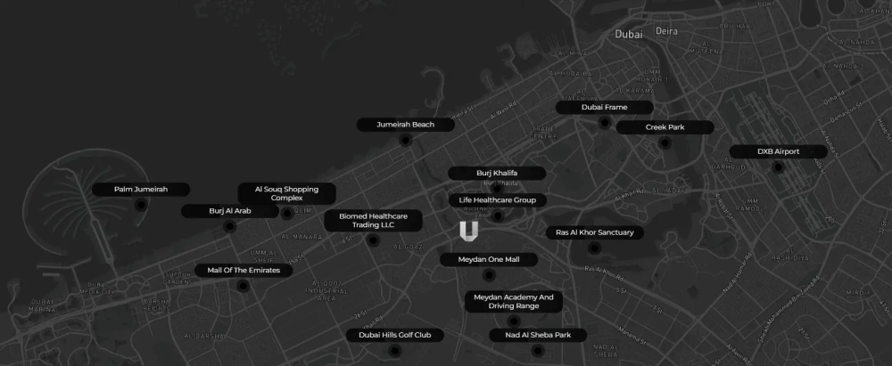

Urban Life Residences, a luxurious residential development, is strategically located in the heart of Dubai's Business Bay. This vibrant district offers a blend of modern living, business opportunities, and world-class amenities. Residents of Urban Life Residences will enjoy easy access to renowned landmarks, upscale shopping malls, and fine dining establishments.

## **Luxurious Apartments and World-Class Amenities**

Urban Life Residences offers a range of thoughtfully designed apartments, including studios, one-bedroom, and two-bedroom units. Each apartment is characterized by its spacious layout, premium finishes, and contemporary design. Residents can also indulge in a variety of on-site amenities, such as a state-of-the-art gym, swimming pool, spa, sauna, and jogging track. For families, there is a dedicated children's play area and ample green spaces.

## **A Convenient and Connected Lifestyle**

Urban Life Residences is ideally situated for professionals and families alike. The development offers excellent connectivity to major highways, making it easy to commute to other parts of Dubai. Residents can also enjoy a leisurely stroll along the Dubai Canal Promenade, which is just a short distance away. Additionally, the iconic Burj Khalifa and Dubai Mall are within easy reach.

## **Investment Opportunity**

Urban Life Residences presents an excellent investment opportunity. The project's prime location, luxurious amenities, and growing demand for high-quality residential properties in Dubai make it a desirable choice for both homeowners and investors.

## **Key Highlights:**

- Prime location in Dubai's Business Bay

- Luxurious apartments with modern finishes

- World-class amenities, including a gym, pool, and spa

- Excellent connectivity to major highways

- Close proximity to renowned landmarks and attractions

- Investment potential
