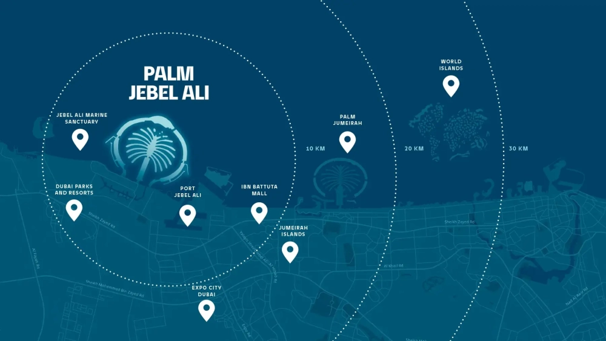

Villa Crystal Springs, part of Nakheel’s prestigious Beach Collection Villas on Palm Jebel Ali, is a testament to refined minimalism in architectural design. This luxurious G+2 villa blends seamlessly with its coastal surroundings, offering an exclusive lifestyle with direct beach access. Ideal for discerning homeowners, the residence balances elegance, functionality, and a connection to nature.

Boasting approximately 8,465 sqft (786 m²) of living space, the villa features five expansive bedrooms, a family room, and a rooftop lounge with a wrap-around terrace. The design harmonizes indoor and outdoor areas, with bold geometric shapes and expansive glass exteriors that invite natural light into the home. The interiors exude understated luxury, showcasing plush materials, sophisticated finishes, and an open layout. The main living and dining areas provide breathtaking water views, amplifying the villa’s serene ambiance.

Each bedroom is thoughtfully designed with en-suite bathrooms and dressing areas to ensure privacy and comfort. The master suite, a tranquil retreat, highlights clean lines and natural elements, complemented by panoramic coastal views. A guest bedroom on the ground floor enhances the villa’s hospitality, while the modern kitchen, equipped with top-tier appliances, blends style and practicality. Additional spaces, including a maid’s room, driver’s room, laundry, and storage areas, add to the convenience of everyday living.

The rooftop lounge and terrace redefine relaxation and entertainment. Designed to provide immersive views of the crystal-clear waters and lush greenery, this space allows residents to enjoy the tranquil environment throughout the year. Whether for quiet moments or lively gatherings, the rooftop embodies the villa's commitment to luxury and leisure.

## **An Exclusive Lifestyle in a Vibrant Community**

Set within a meticulously planned neighborhood, Villa Crystal Springs offers a unique charm and architectural character among the Beach Collection Villas. Located in a private beachfront enclave, the residence provides direct access to serene beach paths and verdant green corridors, fostering a deep connection with nature.

Investing in property on Palm Jebel Ali promises significant potential. With plans to accommodate 35,000 families and an additional 110 kilometers of coastline, the area is set to redefine luxury beachside living in Dubai. Villa Crystal Springs, with its strategic location, exceptional design, and comprehensive amenities, stands out as a prime investment opportunity in the UAE's thriving real estate market.
